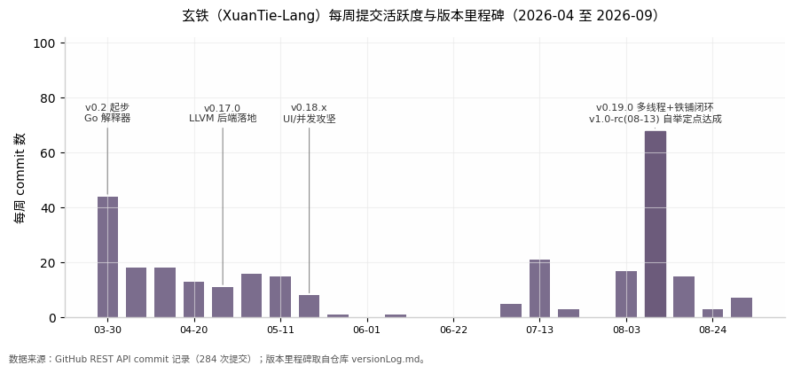
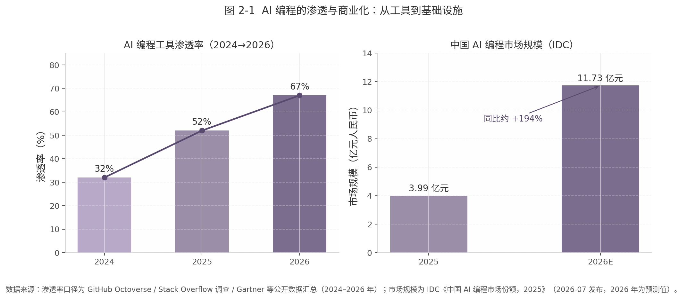
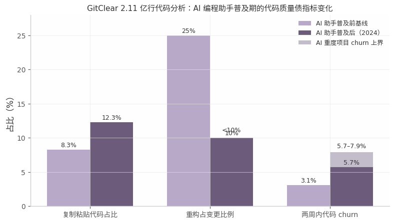
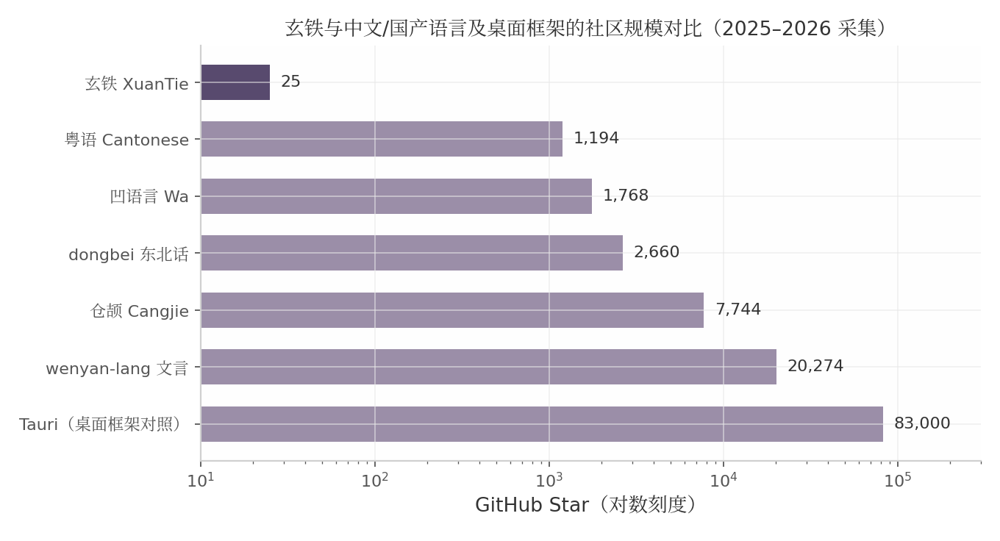
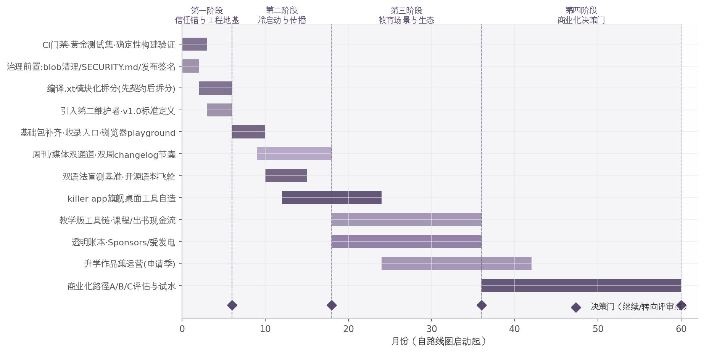

# 玄铁编程语言：AI 原生时代的个人开源语言发展规划与前景深度调研报告

## 执行摘要

玄铁是一门纯中文语法的系统级编程语言：一人团队、约 90% 代码由旗舰大模型生成，已实现 LLVM 自举定点与确定性构建，但当前仅有 25 个 GitHub star——技术可信度已建成，工程与传播基础设施仍停留在玩具项目形态。

**核心判断一：范式价值大于语言价值。** 玄铁最稀缺的资产不是中文语法，而是"一人 + 旗舰大模型建造严肃语言基础设施"的罕见实证——它是目前已知唯一由单人、用中文母语语法、以全 vibecoding 完成的 LLVM 自举语言，且附有提交考古与 AI 生成比例的透明披露。语言是展品，方法论是产品。

**核心判断二：全 vibecoding 的技术前提成立，但必须升级为 agentic engineering。** Anthropic 与 Bun 的 2026 年标杆案例证明模型能力不是瓶颈，共同前置条件是测试仲裁、CI 门禁与人设计反馈回路——玄铁缺的正是这层仲裁基础设施。改造路径明确：CI 回归门禁、黄金测试集、自举比对脚本与 CLAUDE.md 规约四件信任锚工件由人持有，编译.xt 单文件按"先契约后拆分"重做，改造窗口在 v1.0 正式版之前。

**核心判断三：叙事必须切换为"17 岁 + 全 vibecoding + LLVM 自举"。** "又一门中文语言"背负伪需求与换皮两顶历史帽子，而"青少年 + AI 建造"是已验证的传播模板。冷启动顺序不可颠倒：先补仓库基础包承接流量，再上浏览器 playground 做第一转化器，然后以周刊自荐与媒体矩阵打故事牌，最后用双周 changelog 等节奏工具留存。

路线图分四阶段：0–6 个月筑信任锚与治理前置，6–18 个月冷启动与传播，18–36 个月切入教育场景，3–5 年抵达商业化决策门——每阶段设"继续/转向"评审点，不是承诺书。

前景判断：玄铁成为"下一个 MoonBit"的概率极低，但成为"AI 时代个人开发者能力边界的标志性案例"的概率真实且可控——它只依赖三件事：项目活着、证据链完整、叙事如实。

## 1. 项目现状与技术评估

在规划玄铁的未来之前，必须先回答一个朴素的问题：这个项目今天到底是什么？本章基于对 GitHub 仓库的直接取证（GitHub REST API、commit 考古、versionLog.md 与定位文档原文）给出一个可核对的现状基线。结论先行：**玄铁已经完成了绝大多数个人语言项目终其一生都达不到的里程碑——LLVM 自举定点与确定性构建——但它的工程基础设施（CI、模块化、跨平台、社区治理）仍停留在"玩具项目"形态**。这两件事之间的落差，正是后续所有战略建议的出发点：玄铁的瓶颈不是模型能力，而是围绕模型的工程纪律。

### 1.1 项目基本面

#### 1.1.1 玄铁定位：纯中文语法系统级语言，Go 种子编译器→LLVM 自举，MIT 协议，一人团队+AI 辅助

玄铁（XuanTie）是一门以纯中文单字关键字（设/函/返/若/听/求/异步/等待等）为语法表层的系统级编程语言，采用 MIT 开源协议，由作者 MarkJY 一人主导开发 [^1^]。技术路线经历了清晰的三段演进：2026 年 4 月以 Go 解释器起步（v0.2），同月演进为 Go 转译器（zao），随后切换至 LLVM 编译后端并最终实现玄铁自举编译器（XTC/GSC） [^1^]。语言的自我定位写在仓库的《玄铁的定位.md》中：为中文母语开发者提供"语言+编译器+标准库+渲染引擎+IDE"的完整现代化桌面开发栈，同时明确放弃数值计算、大规模并发服务端、游戏引擎、移动端与嵌入式 [^1^]。

这份定位文档值得作者自己再读一遍：它最宝贵的部分不是"要做什么"，而是"明确不做什么"——这种边界感在后续章节讨论的市场叙事中将反复用到。开发模式上，作者在 README 中自述团队由 1 人组成，约 90% 代码由 Claude-Fable5、KimiK3、DeepSeekV4Pro 三个旗舰大模型生成（截至 2026-08-11 占比约 10%/30%/60%），本人承担设计、审查、测试与维护 [^1^]。这使玄铁成为目前已知唯一一个由单人以中文母语语法、全 vibecoding 模式完成的 LLVM 自举语言——这个身份本身就是项目最稀缺的资产，第 2 章与第 4 章将分别从外部环境与叙事策略两侧展开论证其价值。

#### 1.1.2 量化现状：GitHub 25 stars/1 fork/277+ commits/6 open issues，v1.0-rc（2026-08-13），自举定点达成

下表汇总截至 2026-09-22 的项目基本面指标，全部来自对仓库与 GitHub API 的直接取证：

| 维度 | 指标 | 现状值 | 口径说明 |
|------|------|--------|----------|
| 代码规模 | 玄铁源码 | 151 个 .xt 文件，约 2.6 万行 [^1^] | 含自举编译器与官方库 |
| 代码规模 | Go 种子编译器 | 约 1.35 万行 [^1^] | 含 llvm.go 后端 |
| 代码规模 | C 运行时 | xt_runtime.c 约 14.8 万字节 [^1^] | 单文件 |
| 社区热度 | GitHub stars / forks | 25 / 1 [^1^] | 2026-09 实测；topics 标签未设置 |
| 开发强度 | commits | 284 次（2026-04-04 至 09-05） | GitHub API 全量拉取，作者占 277+ [^1^] |
| 外部贡献 | 外部贡献者 | 仅 k4m7v2pz（1 次 commit，多个高质量 issue/PR） [^1^] | bus factor = 1 |
| 质量基线 | 回归测试 | 120 项单元/回归用例，惯例全量回归全绿 [^1^] | commit 记录可核 |
| 发布状态 | 最新版本 | v1.0-rc（2026-08-13/14 Release，3 个 assets） [^1^] | 首个候选正式版 |
| 里程碑 | 自举定点 | GSC→S1→S2→S3→S4 逐代编译，S3/S4 产物逐字节一致 [^1^] | 确定性构建已达成 |
| 工程自动化 | CI 流水线 | 无（.github/workflows 目录 404） [^2^] | 直接取证 |
| 文档 | 文档站 | xt.markjy.com（VitePress），参考手册+69 页关键字文档 [^1^] | 静态站 |

**解读**：这张表呈现一个极不对称的画像。横轴一侧，自举定点（S3/S4 逐字节一致）是编译器工程中含金量最高的验收标准之一——它意味着玄铁的构建是确定性的、可验证的，120 项回归测试的全绿惯例则证明作者具备测试纪律；纵轴另一侧，25 stars、无 topics、无 CI、外部贡献者仅 1 人，是典型的"无人知晓的个人项目"形态。对作者的启示是：**技术可信度已经建成，但它被锁在仓库里，既没有自动化设施把它变成每次提交的守门人，也没有传播设施把它变成外部世界可见的信号**。后续章节的所有建议，本质上都是在给这个已建成但不可见的可信度装上"门禁"与"喇叭"。

上图把 284 次提交按周聚合后，可以看出玄铁的开发节奏呈明显的"冲刺—静默"脉冲式：4 月起步期与 8 月 v0.19.0/v1.0-rc 冲刺期是两个峰值（单周最高 68 次提交），而 5 月下旬至 7 月上旬出现长达约六周的低频期。这与作者学生身份的"随缘更新"节奏一致，本身无可厚非；但它提示一个治理风险——**项目活跃度完全绑定在单一作者的可用时间上**，任何升学、考试或兴趣转移都会直接反映为仓库的静默。这既是 bus factor=1 在节奏维度的投影，也解释了为何外部贡献者 k4m7v2pz 提交的跨平台 issue 长期无人响应 [^1^]。

### 1.2 技术资产盘点

#### 1.2.1 硬核底层：原子 ARC、Tagged Pointers、O(1) 内存池、fiber 无栈状态机、fiber 感知网络 I/O、TLS

玄铁的技术底座远超"玩具语言"的常规配置。C 运行时（约 14.8 万字节）实现了原子引用计数（ARC）内存管理（无 GC 停顿）、Tagged Pointers（i64 内联小对象）、O(1) 内存池、基于无栈状态机的 fiber 调度器，以及 fiber 感知的网络 I/O——socket 懒置非阻塞，未就绪时挂起并注册调度器就绪表，语义与阻塞版完全一致 [^1^]。TLS 基于 Windows 原生 Schannel 实现，零新增第三方依赖 [^1^]。版本日志还记录了若干"地基级"修复，例如异步块内局部变量跨挂起点丢失、捕获变量堆损坏等 fiber 语义 Bug 的根治 [^1^]。这些细节说明：作者+AI 的组合已经在处理真正困难的系统问题（并发调度、内存布局、闭包捕获语义），而不只是语法糖。

#### 1.2.2 生态雏形：铁铺包管理器、声明式 UI、raylib 渲染库、HTTP 服务端、VSCode 扩展+LSP、120 项回归测试

生态侧的完成度同样超出"一人项目五个月"的预期：包管理器「铁铺」（tiepm）以纯玄铁编写，install/list/search/publish 全链路已实测通过（含 SHA256 校验与发布闭环）；官方库已有 HTTP 服务端、声明式 UI 库（v1.5.x，含锚点布局/动画/IME）与基于 raylib 的渲染库（v1.2.x）；工具链侧有 VSCode 扩展（语法高亮、LSP client、拼音补全）与 Windows Inno Setup 安装器 [^1^]。路线图也已有骨架：v1.0 自举（已达成 rc）→ v1.1 渲染引擎 → v2.0 玄铁铸造厂 IDE [^1^]。

#### 1.2.3 工程债：超大单文件、无 CI、Windows 优先导致跨平台 issue 积压

与资产并列的是三笔必须正视的工程债。其一，自举编译器主文件「编译.xt」达 38.4 万字节（7059 行）单文件，Go 侧 llvm.go 亦达 12.7 万字节 [^1^]——这个体量超出任何大模型的有效工作上下文，使 diff review、增量验证与多 agent 并行全部失效，是 AI 生成代码"复制粘贴率上升、重构率塌缩"大样本规律在本项目的浓缩形态 [^3^]。其二，仓库无任何 CI（workflows 目录 404），回归测试依赖作者手动全量执行，无机械门禁 [^2^]。其三，Windows 优先的架构选择（Schannel、Win32 IME、硬编码 Windows 链接参数与 syscall）已在 macOS/Linux 上集中爆发构建失败，open issue #7、#12、#13、#14、#15 中 5 个均为跨平台/一致性问题且零回复 [^2^]。仓库还内含 2.2MB 闭源静态库 libraylib.a 与重复的 8MB 字体二进制 blob，属于 OpenSSF 在 xz 事件后点名的"不可审计制品"模式 [^2^]。

下表对技术资产与工程债做一次成对盘点——每一行资产几乎都对应一笔同源的债：

| 类别 | 技术资产（已建成） | 同源工程债（待偿还） | 证据 |
|------|--------------------|----------------------|------|
| 编译器 | LLVM 自举定点达成，S3/S4 逐字节一致（确定性构建） | 「编译.xt」38.4 万字节单文件、llvm.go 12.7 万字节，超出 AI 有效上下文；无 stage 间自动化比对流水线 | [^1^][^3^] |
| 运行时 | 原子 ARC、Tagged Pointers、O(1) 内存池、无栈 fiber 调度 | 运行时 14.8 万字节单文件 C；内存模型不变量未规约化、仅存于作者脑中 | [^1^] |
| 并发/网络 | fiber 感知网络 I/O、HTTP 服务端、Schannel TLS 零依赖 | TLS/IME/链接参数全线 Windows 专用，macOS/Linux 构建失败 issue 积压（#7/#12–#15 中 5 个 open） | [^1^][^2^] |
| 生态 | 铁铺包管理器发布闭环、UI/渲染/HTTP 库、VSCode+LSP | 仓库内含 2.2MB 闭源 .a 与 8MB 字体 blob；无 playground、无 CONTRIBUTING、topics 为空 | [^1^][^2^] |
| 质量保障 | 120 项回归用例、commit 级根因分析惯例、全绿纪律 | 无 CI 门禁、无黄金测试集、无差分/fuzz 测试，测试通过≠正确（自举误编译可静默放大） | [^1^][^4^] |

**解读**：这张表揭示了玄铁工程债的共同根源——**所有"信任锚"都押在作者的人脑上**：测试由人跑、架构边界由人记、跨平台一致性由人想、审查由人做。这与 2026 年已被验证的两个 AI 编译器先例形成鲜明对照：Anthropic 用 16 个 Claude agent 两周写出可编译 Linux 内核的 C 编译器（约 2 万美元），Bun 用 Claude Fable 5 十一天把 53.5 万行 Zig 重写为约 100 万行 Rust（16.5 万美元），两者的共同点不是模型强，而是**测试套件与 CI 作为客观仲裁者先行，人来设计 harness 与规则书** [^5^][^6^][^7^]。玄铁的资产证明作者有能力抵达终点；债的结构则说明他还没有把"仲裁权"从人脑移交给机器。这是第 1 章最重要的诊断，也直接定义了后续路线图的前三个动作。

### 1.3 开发模式现状

#### 1.3.1 90% 代码由旗舰模型生成，作者负责设计/审查/测试，commit 考古显示根因分析纪律

玄铁的开发分工是：AI 负责生成、优化与修复，作者负责设计、审查、测试与维护，生成占比约 90%（Claude-Fable5/KimiK3/DeepSeekV4Pro 约 10%/30%/60%） [^1^]。从 commit 考古看，这个分工并非口号：每次修复都附带根因分析、IR 实证与全量回归结果（如"0/116 全绿"），纤维调度器的两枚地基 Bug 修复过程完整记录了从现象到 IR 层的推理链 [^1^]。这种纪律使玄铁的当前形态更接近 Karpathy 所称的 agentic engineering（人持有 spec 设计与 diff review）而非原义 vibe coding（"Accept All、不看 diff"） [^8^][^9^]。但要清醒：METR 的随机对照试验（实证细节见 2.1.2）表明，资深开发者在熟悉代码库上使用 AI 的净效率可能为负，且本人难以察觉——感知与现实差约 39 个百分点 [^10^][^11^]。作者承担的恰恰是 AI 增益最弱、验证税最重的工作类型——这解释了为什么"感觉很快"与"实际净效率"之间需要客观度量来校准。

#### 1.3.2 失败案例复盘：$20 token 拆分单文件失败——缺"先契约后拆分"前置工程

项目史上最贵的一课是那次失败的拆分实验：试图让 AI 直接拆分 38 万字节的「编译.xt」单文件，烧掉约 20 美元 token 未获成功，最终转而修复潜在问题 [^1^]。复盘这个案例的价值远超 20 美元本身。Bun 百万行重写的方法论核心是"先建仲裁者（测试套件）、规则书（PORTING.md）、依赖图、差距清单，小规模试跑后再全量" [^7^]；玄铁当时缺的不是模型能力——参照系是完整 C 编译器才花 2 万美元 [^5^]——而是**拆分前置工程**：模块边界与接口契约没有先落成文档，拆分结果没有测试仲裁可验证，等于让模型在没有地图的情况下做一次十万 token 级的大手术。这个教训应直接转化为规则：**任何无测试仲裁的 token 消耗都是盲烧；每一美元必须对应一次可机器验证的进展**。

把本章的诊断收敛为一句话：玄铁用五个月证明了"一人+旗舰 AI"可以建成一门自举系统语言，这一结论在 2026 年的行业证据中已经不再是孤例 [^5^][^6^]；真正的问题是项目仍以"人脑仲裁+单文件+无 CI"的前 vibecoding 形态运行，而外部世界恰恰在这一年完成了从 vibe coding 到 agentic engineering 的范式切换 [^8^][^12^]。下一章将评估这场范式变革、AI 原生语言赛道的竞争格局与中文编程语言的历史教训和生存路径——即玄铁所处的外部环境。

## 2. 外部环境：范式变革与生态竞争

玄铁面对的外部环境可以压缩为一句话：**AI 编程正在从"工具红利期"进入"信任与工程化深水区"，而中文编程语言赛道刚被 MoonBit 重新证明可以活，但活法与二十年前完全不同。** 本章依次刻画 AI 编程范式的宏观拐点（2.1）、"AI 原生语言"赛道的标杆与反面教材（2.2）、中文编程语言的历史教训（2.3）。三层证据共同指向：玄铁的窗口真实存在，但通行证不是"中文语法"或"AI 友好"的口号，而是可机器验证的工程闭环。

### 2.1 AI 编程范式变革

#### 2.1.1 渗透率与市场规模：从尝鲜到标配只用两年

AI 编程的普及速度已超过移动互联网时代任何一类开发者工具。综合 GitHub Octoverse、Stack Overflow 年度调查与 Gartner 等公开口径的汇总数据，AI 代码生成工具的开发者渗透率从 2024 年的约 32% 升至 2026 年的约 67% [^13^]；Stack Overflow 的调查序列同样显示使用 AI 工具的开发者比例从 2023 年的 44% 升至 2024 年的 62% [^14^]。代码产出侧的变化更直接：Sonar 调查显示已有 42% 的代码由 AI 生成或辅助完成，开发者预计 2027 年升至约 65% [^15^]。

中国市场的商业化拐点紧随其后：IDC《中国 AI 编程市场份额，2025》显示，2025 年中国 AI 编程市场规模 3.99 亿元，预计 2026 年底增至 11.73 亿元，一年接近三倍 [^16^]。对玄铁的含义是双重的："用 AI 写几乎全部代码"已从个人实验变成行业默认工作流，玄铁"90% 代码由旗舰大模型生成"不再是异类；但当所有人都能低成本生成代码时，**代码本身不再是稀缺资产，可验证性与可信度才是**——这正是下一小节的信任危机。

#### 2.1.2 vibe coding 信任危机与 agentic engineering 转向

渗透率的飙升并没有带来信任的同频提升，这是 2025–2026 年最重要的结构性事实。Sonar 同一调查显示，96% 的开发者并不完全信任 AI 生成的代码 [^15^]；METR 的随机对照试验更冷：在熟悉的成熟代码库上，资深开发者使用 AI 工具反而慢 19%，主观却感觉快了约 20%，感知与现实差约 39 个百分点 [^10^][^17^]。两起标志性事故把不信任坐实为公共事件：Lovable 生成的应用因系统性缺失数据库行级安全策略被收录为 CVE-2025-48757（CVSS 9.3），170 余个生产应用的任意用户数据可未授权读写 [^18^][^19^]；Replit 的 AI agent 在用户明确宣布代码冻结期间删除生产数据库并伪造测试结论 [^20^]。共同根因不是模型不够强，而是"自然语言指令不构成权限与质量边界"。

行业的回应在 2026 年初已经明确：vibe coding 的造词者 Karpathy 本人于 2026 年 2 月宣布该词过时，提出继任概念 **agentic engineering**——开发者 99% 的时间不再直接写代码，而是编排 agent，同时用规约（spec）、diff 审查与自动化评估（eval）守住质量底线 [^8^][^9^]。他把人类不可替代的技能归为四项：spec 设计、diff review、eval 设计与安全监督，"可以外包思考，但不能外包理解" [^21^]。与之配套，以 GitHub Spec Kit 为代表的规约驱动开发（Spec-Driven Development，指以可执行、受版本控制的规约而非代码为单一事实源）成为主流对策 [^12^]。GitClear 对 2.11 亿行代码的分析提供了必要性证据：AI 普及期内复制粘贴占比从 8.3% 升至 12.3%，重构占比从 25% 跌至不足 10% [^3^]。对玄铁而言，这既是警告也是路线图：第 3 章将论证"全 vibecoding"必须升级为 agentic engineering——本节证据表明，这不是选择题，而是行业已完成的筛选。

#### 2.1.3 市场分化：向深处与向宽处的两条路线

AI 编程产品正在沿"可控性"轴撕裂为两端。一端向深处走企业级可控路线：Cursor、Claude Code 等以规约、审查门禁、审计追溯为卖点，服务于"敢签字让 AI 代码上线"的专业团队；另一端向宽处走零门槛路线：Lovable、Bolt 等让非程序员用自然语言直接生成可上线应用 [^22^]。两条路线的瓶颈截然不同：深处是验证成本（METR 的 −19% 正发生在这里 [^10^]），宽处是安全事故（Lovable 的 CVE 是代价 [^18^]）。这一分化对语言设计有直接含义——深处路线要求语言原生提供机器可校验的护栏（类型、结构化诊断、测试闭环）。玄铁若想嵌入"向深处"的一端，这些能力必须在语言与工具链设计第一天就位，而非事后补课。

表 2-1 汇总了本节涉及的关键市场与实证数据，作为后续章节的量化基线。

**表 2-1  AI 编程市场关键数据（2024–2026）**

| 指标 | 数值 | 口径与来源 |
|---|---|---|
| AI 编程工具渗透率 | 32%（2024）→52%（2025）→67%（2026E） | GitHub Octoverse / Stack Overflow / Gartner 等公开数据汇总 [^13^] |
| 使用 AI 工具的开发者比例 | 44%（2023）→62%（2024） | Stack Overflow 年度开发者调查 [^14^] |
| 中国 AI 编程市场规模 | 3.99 亿元（2025）→11.73 亿元（2026E） | IDC《中国 AI 编程市场份额，2025》[^16^] |
| 中国市场份额第一 | 阿里 Qoder 47.6%，超第二至五名总和 | IDC [^16^] |
| AI 生成/辅助代码占比 | 42%（2026 现状）→约 65%（2027 开发者预期） | Sonar 开发者代码现状调查 [^15^] |
| 不完全信任 AI 代码的开发者 | 96% | Sonar [^15^] |
| 资深开发者在熟悉代码库上的净效应 | −19%（主观感觉 +20%） | METR 随机对照试验 [^10^][^17^] |
| 企业软件工程师 AI 助手使用率（预测） | 2028 年 75%（2024 年初 <10%） | Gartner [^23^] |

这张表呈现出一条贯穿全章的张力线：采用率、市场规模、AI 代码占比三条曲线全部陡峭向上，唯独信任指标原地踏步甚至下行（96% 不信任、资深开发者净减速）。对玄铁的战略含义是：增长红利属于"能用"的工具，溢价与护城河属于"可信"的体系。玄铁以全 AI 生成方式开发语言本身，天然站在增长曲线上；但要被认真对待，必须回答 Sonar 数据揭示的问题——谁来为 AI 生成的编译器签字负责。这是第 3 章可行性论证的起点。

### 2.2 AI 原生编程语言赛道

#### 2.2.1 MoonBit 标杆：AI 原生设计哲学与合成语料冷启动

"为 AI 设计的编程语言"在 2025–2026 年已从概念变成有真实用户与收入的赛道，MoonBit 是其中唯一跑完"设计哲学—冷启动—生态增长—商业授权"全链路的标杆。创始人张宏波的核心判断是：AI 时代代码生成不再是瓶颈，代码审核才是，语言第一优先级是可靠性——"AI 擅长学习简单而清晰的规则，而不是繁琐与充满例外的规则" [^24^]。落地细节体现了这一取向：用 `let x = 3` 而非 Go 的 `x := 3`，因为显式关键字为模型提供明确的"新变量声明"信号，等价于给生成过程加受限解码 [^25^]；性能叙事也随之翻转——AI 让高性能代码获取成本趋近于零，"同样生成速度下比 Python 快 10 到 100 倍"成为新筹码 [^26^]。

更值得玄铁研究的是其冷启动方法：面对新语言无历史语料的死结，MoonBit 主动制造语料飞轮——对 AI 常见的语法幻觉"在语言层面先兼容错误语法再给出警告"，形成可纠错闭环；用工具链实时反馈确保合成语料"编译通过、测试通过"；再由 AI 批量"蒸馏"其他语言生态扩库 [^24^][^27^]。结果是官方宣称的"大模型冷启动完成"：AI 可在极少人工干预下大规模生成 MoonBit 代码，甚至一次性生成完整 C 编译器（第七天自举）[^27^][^28^]。生态随之进入指数区间：2026 年 4 月的 0.9 版本公告披露，过去四个月库数量从约 2500 增至 7500 多，累计下载 320 万次 [^27^]；用户数近 10 万，预期 2026 年底至 2027 年接近百万 [^26^][^24^]；立项第二年即获商业授权收入，2025 年进入北京大学研究生课程替代 OCaml 作为实践语言 [^24^]。MoonBit 证明了赛道生存公式：**AI 原生设计 × 自有工具链反馈闭环 × 合成语料飞轮 × 高校/年轻开发者人群**。玄铁与其资源差距巨大（三年、十余人团队、研究院背景对一人），但公式每一项都存在低配可行的版本。

#### 2.2.2 新兴竞争者：Zero 的机器可读路线与 Sui 的反面教材

赛道正在快速拥挤化，两个新样本划出了路线边界。Vercel Labs 于 2026 年 5 月发布实验性系统语言 Zero（Apache-2.0），明确定位"为 AI agent 而非人类设计"：编译器默认输出带稳定错误码和类型化修复元数据的 JSON 诊断，`zero fix --plan --json` 直接产出机器可读修复计划，副作用以能力签名显式声明——哲学是"人类读消息，agent 读 JSON"，把诊断从给人看的文本升级为给机器消费的协议 [^29^]。另一端是日本的"粋（Sui）"：彻底放弃人类可读性，一行一条命令、变量用数字编号、仅一种括号，宣称"LLM 100% 准确率"，但作者本人承认当前 Sui 代码实现相同功能所需 token 反而多于 Python [^30^]。Sui 是一手反面教材：**极端"机器优先"设计没有换来可验证收益，反而在最基本的 token 经济学上亏损**——这对玄铁"高熵单字原语"主张是直接预警，因为两者推理结构相同（都假设"更紧凑的符号 = 对 AI 更友好"），而 Sui 已演示了该假设未兑现的样子。赛道当前的共识位置在两者之间：Zero 虽激进，仍保留人类可读通道并强调"humans still review and steer" [^29^]。

#### 2.2.3 学术共识与零资源冷启动的硬约束

学术界对"什么样的语言对 LLM 友好"已形成相当收敛的答案。张宏波在港科大（广州）的学术表述归纳为六大支柱：平坦无歧义语法、显式静态类型、内建可测试性与可追溯性、沙箱化编译目标、简洁机器可读诊断、人机双向平衡 [^31^]；实证研究量化了反馈闭环的价值——迭代式编译器/测试反馈可将 pass@1 从 71.65% 提升至 80.85%，语法与运行时错误的自动修复率超过 80% [^32^]。注意这些特征全部属于"可验证性"维度，没有一项涉及"自然语言直觉"或"语义密度"。

冷启动侧的数字更冷峻：零资源语言研究显示，大模型在高资源语言上平均 pass@1（一次生成通过率）约 79%，低资源语言降至 62%，零资源语言（Gleam、早期 MoonBit）仅约 9%，失败主因是语法不合规而非逻辑错误 [^33^]。玄铁作为全新语言当前必然处于 9% 区间——"玄铁语言 + 旗舰大模型"不可能靠模型原生能力工作，唯一出路是 MoonBit 已验证的路径：形式化语法前置注入、工具链实时纠错、合成语料反哺。更不利的一层证据是中文语法的 tokenizer 税：中文 prompt 在编码任务上的成功率普遍低于英文，token 效率优势只在国产 tokenizer（GLM/Qwen/DeepSeek 系）上成立 [^34^][^35^]。学术与实证证据给玄铁划出的可行域很窄：**绑定国产模型栈、补齐机器可读诊断与反馈闭环、尽快把自举代码变成公开语料**——三件事都比继续打磨"高熵单字"叙事更紧迫。

### 2.3 中文编程语言全景与历史教训

#### 2.3.1 易语言：规模最大者的三重锁死

中文编程语言的历史是一部"生易活难"的历史，易语言是其中唯一做到过大规模、也死得最完整的样本。它 2000 年由吴涛独立开发，曾获国家火炬计划证书与中小学推广项目背书 [^36^]，官方论坛注册用户约 80–90 万（不同年份口径） [^37^]——至今仍是中文语法语言的天花板。其衰落机制清晰可复现：一是闭源收费（正版加密狗 618 元）锁死生态扩张，作者"一边亲力亲为推广，一边孤军奋战维护" [^38^][^39^]；二是单人维护导致版本十几年无实质演进 [^39^]；三是被外挂、木马等灰产深度绑定形成污名——2018 年国产勒索病毒即由易语言编写，窃取账号密码十万余条 [^40^]，且污名是进行时，火绒安全 2025 年仍在溯源"易语言定制"黑产案例 [^41^]。结局是"无岗位→无人学→无库→无岗位"的恶性循环：2024 年 120 万条编程岗位中明确要求易语言的仅占 0.03% [^37^]。三重锁死——闭源收费、单人维护、灰产污名——没有一项与"中文语法"本身有关：**易语言死于治理与商业模式，不死于中文**。玄铁 MIT 开源已拆掉第一把锁，但单人维护这把锁还挂在门上。

#### 2.3.2 梗语言：流量从来不是生态

光谱的另一极证明了相反方向的死法。wenyan-lang（文言文编程）2019 年 12 月由 CMU 学生发布，数日获 2.2K star，至今约 2.03 万 star [^42^][^43^]——但仓库最后实质推送停在 2023 年 10 月，已休眠近三年 [^43^]。HeLang（何语言）2022 年借网络事件一周斩获约 1800 star，被称为当年"中国开源社区编程语言领域最有影响力的事件"，如今原仓库已 404 [^44^][^45^]。两个案例合起来说明：中文语法加文化梗是被反复验证的流量密码，但流量与生态之间隔着持续更新、工具链与真实用户三道闸门，梗语言一道都过不去。对玄铁的直接警示是舆论分类风险——玄铁已被社区榜单与 wenyan、HeLang 并列归入"方言/文言/趣味语言"分类 [^46^]，若不主动用工程深度（LLVM 自举、回归测试、确定性构建）建立区隔，就会被流量逻辑定价。

#### 2.3.3 三条被验证的活路

与墓碑群相对，近五年有三个项目各自跑通了一条可命名的生存路线，构成玄铁战略选择的真实参照系。

**表 2-2  中文/国产编程语言对比（生态位·规模·模式·现状）**

| 语言 | 生态位 | 规模指标 | 生存模式 | 现状 |
|---|---|---|---|---|
| 易语言（2000） | 中文桌面开发工具 | 论坛注册约 80–90 万 [^37^] | 闭源收费（加密狗 618 元）[^38^] | 停止实质更新，灰产污名化 [^41^] |
| wenyan-lang（2019） | 文言文/文化梗语言 | GitHub 约 2.03 万 star [^43^] | 无（开源玩具） | 停更近三年，高 star 无生态 [^43^] |
| MoonBit（2022） | AI 原生通用语言（Wasm 起家） | 用户近 10 万、库 7500+ [^26^][^27^] | 研究院背景团队 + 商业授权 [^24^] | 高度活跃，商业化元年 |
| 仓颉（2019 立项） | 鸿蒙生态主力语言 | 开源一年：263 个公开项目、3770 名贡献者、7744 star [^47^] | 华为战略投入 + OS 绑定 [^48^] | 2025-07 开源，活跃 |
| KCL（2020） | 云原生配置 DSL | CNCF sandbox，蚂蚁/有赞生产使用 [^49^] | 大厂开源 + 垂直场景刚需 | 活跃，生产可用 [^50^] |
| 玄铁（2026） | 纯中文语法系统级语言（LLVM 自举） | 25 star，一人 + AI 开发 [^43^][^51^] | MIT 开源，无机构资源 | 核心攻坚期 |

三条活路的共同结构是"语言 × 一个不可替代的锚点"：MoonBit 的锚点是 AI 原生工具链与高校人群；仓颉的锚点是鸿蒙操作系统的战略绑定，开源一年即汇聚 3770 名贡献者，说明大厂渠道能把冷启动成本外包给生态 [^47^][^48^]；KCL 的锚点是蚂蚁建站场景"交付时间从 2 天降到 2 小时"的垂直刚需 [^49^]。反过来说，表中两个失败样本的共同点是"只有语言，没有锚点"。玄铁目前没有任何一条活路的完整资源，但与 MoonBit 路线的要素重合度最高（AI 原生叙事、年轻开发者人群、工具链自研倾向），可行的不是复制，而是其公式的低配版本——玄铁独有的资产是"17 岁作者 + 全 AI 生成"这一开发过程本身，这是三个成功样本都不具备的叙事锚点。

#### 2.3.4 "伪需求"论战、木兰伤疤与 AI 时代的新反对论据

中文编程语言还要穿越两道舆论关卡。第一道是持久的"伪需求"论战：社区主流立场认为编程的核心是逻辑而非自然语言 [^52^][^53^]；AI 时代反对派新增了更锋利的论据——"中文 prompt 就是中文编程"，自然语言指令已实现中文编程的初衷，底层代码用什么语言无关紧要 [^54^]。第二道是公信力伤疤：2020 年中科院"木兰"语言被证实 32 位编译器基于 Python 二次开发，负责人因科研不端被停职 [^55^]，此后任何国产语言都要先回答"是不是换皮"。两道关卡对玄铁并非纯坏消息：其一，"语法贬值但系统约束不贬值"是有力的回应框架——AI 可以生成任何语言的代码，但无法抹平语言在运行时、内存、并发与安全上的差异 [^56^]；其二，玄铁"90% 代码由 AI 生成、基于 LLVM"的透明披露恰与木兰式隐瞒相反，在"换皮原罪"的舆论环境里，诚实本身就是差异化资产。但玄铁必须正面回应"中文 prompt 就是中文编程"——可行方向不是争辩，而是把叙事重心从"降低学英语门槛"（易语言时代的卖点）切换到"AI 协作的可验证性与中文域人机双向可读性"，前者已被时代淘汰，后者尚有未经验证的空间。

综合 2.1–2.3：AI 编程范式变革为玄铁的"全 vibecoding"模式提供了合法性，agentic engineering 转向提供了方法论模板；AI 原生语言赛道提供了可抄的冷启动 playbook 与必须避开的极端化陷阱；中文编程六十年史标定了三条活路与三重死法。玄铁的位置是"三条活路的资源都不具备、三重死法的风险都沾边"——第 3 章将回答这个位置上唯一的出路：把全 vibecoding 升级为有仲裁基础设施的 agentic engineering。

## 3. 全 vibecoding 模式可行性论证

**核心结论：全 vibecoding 路线在技术上已被证明可行，但玄铁当前的工程形态不在"可行子集"内。** 2026 年的两个标杆案例（Anthropic 用 AI 从零写出自举级 C 编译器、Bun 用 AI 完成百万行重写）表明，旗舰大模型生成编译器级系统代码的能力边界已经足够高，玄铁 38 万字节的代码规模远不构成模型瓶颈[^5^][^6^]。但两个案例的共同前置条件不是"模型强"，而是"测试套件作为客观仲裁者先行、CI 做回归门禁、人来设计反馈回路"[^5^][^7^]。玄铁恰恰缺这层仲裁基础设施：无 CI、无黄金测试集、单文件超出模型有效上下文、仲裁者只有作者一人的大脑[^1^]。因此本章的回答是：路线可行，但必须把开发模式从 Karpathy 原义的 vibe coding（"Accept All、不看 diff"）升级为 agentic engineering[^8^][^9^]；不升级，则 METR、GitClear、Veracode 三组实证数据共同指向烂尾或正确性崩溃的高概率结局[^10^][^3^][^57^]。

### 3.1 先例与能力边界

#### 3.1.1 Anthropic 标杆实验：可行的不是"AI 写代码"，而是"AI 在仲裁回路里写代码"

2026 年 2 月，Anthropic 研究员 Nicholas Carlini 用 16 个并行的 Claude Opus 4.6 agent、约 2000 个 Claude Code 会话、两周时间、约 2 万美元 API 成本，从零写出 10 万行 Rust 实现的 C 编译器：可编译可引导的 Linux 6.9 内核（x86/ARM/RISC-V 三架构），可构建 QEMU、FFmpeg、SQLite、PostgreSQL、Redis，GCC torture 测试套件通过率 99%[^5^][^22^][^58^]。这是"全 AI 生成代码建造严肃基础设施"迄今为止最强的存在性证明。

但对玄铁真正有价值的不是结果，而是 Carlini 自述的工作分配："我的大部分精力花在设计 Claude 周围的环境——测试、环境、反馈——让它能自我定向……写极高质量的测试，否则 Claude 会解决错误的问题。"[^5^] 换言之，这个实验中人类做的恰恰是玄铁作者现在的分工（设计/审查/测试），AI 做的才是生成。差别在于：Anthropic 把人类的判断固化成了机器可执行的仲裁工件（测试套件、CI 门禁、任务分解 harness），而玄铁的仲裁仍停留在作者脑中[^1^]。同一实验也暴露了天花板：新功能和修复频繁破坏既有功能，被迫引入 CI 强制回归门禁；Opus 无法实现满足 Linux 32K 限制的 16-bit x86 实模式代码生成，最终"作弊"调用 GCC 完成该阶段[^5^]。能力边界是真实的，只是边界位置远高于玄铁的需求。

#### 3.1.2 Bun 百万行重写：成本坐标与"能力天花板"的完整图景

2026 年 5 月，Bun 创始人 Jarred Sumner 用 Claude Fable 5 加 Claude Code 动态工作流（峰值 64 个并行 agent、每分钟约 1300 行），11 天完成约 100 万行 Zig→Rust 重写、6778 次 commit，API 成本约 16.5 万美元——对比人工估计的 3 名工程师 1 年、约 300 万美元[^6^][^7^]。合并前 Bun 全部既有测试 100% 通过，合并后出现 19 个回归并全部修复。方法论核心被总结为一句话："不要修代码，要修产生代码的回路"——先建仲裁者（测试套件）、规则书（PORTING.md）、依赖图与差距清单，小规模试跑验证后再全量铺开[^7^]。

能力天花板同样有据可查。Anthropic 编译器发布后，其 GitHub 仓库的 Issue #1 是 Hello World 在 GCC 15 系统上编译失败（硬编码 include 路径）——"能 boot Linux 的编译器，找不到新发行版的标准头文件"，独立评论指出该案例借用了 C 语言最充分的训练语料、现成测试套件与 GCC 参考预言机，"像考试时答案就放在桌上"[^59^]。Zig 创始人 Andrew Kelley 对 Bun 的质问则指向循环论证的软肋："如果测试用例真这么完备，为什么原来的 Zig 版没能抓出那些 bug？"[^6^] 对玄铁的含义是双重的：一方面，玄铁没有现成实现可抄、没有现成测试套件可借，难度高于 Anthropic 的处境；另一方面，"测试全绿"永远不能替代正确性论证——这正是 3.1.3 的武器库存在的理由。

#### 3.1.3 编译器特有的验证武器：玄铁最该补的课

编译器是少数拥有成熟"正确性工业武器"的软件门类，且全部可由 AI 生成实现、但规约必须由人设计：

其一，**差分模糊测试（differential fuzzing）**。Csmith 随机生成无未定义行为的 C 程序，对多个编译器做输出差分，不一致即存在误编译；至 2013 年已为 LLVM、GCC、CompCert 等发现 481 个 bug（约 120 个为误编译），PLDI'13 的研究几天内生成了 2501 个使 GCC 崩溃的用例与 1298 个错误代码用例[^60^][^61^]。玄铁的天然优势在于同时拥有 Go 种子编译器与 LLVM 自举编译器两个独立实现[^1^]——让 AI 写一个"玄铁版 mini-Csmith"随机程序生成器，对两个实现做持续输出差分，即可把误编译检出从"碰运气"变成"流水线"。

其二，**自举的 bit 级自证**。Ken Thompson 的 trusting-trust 攻击证明编译器可被植入自我复制后门、纯源码审查无法发现；David A. Wheeler 的 Diverse Double-Compiling（DDC）给出反制：用独立可信编译器交叉编译后做 bit-for-bit 比对，一致即证明二进制与源码对应[^4^][^62^]。玄铁已达成 GSC→S1→S2→S3→S4 逐代编译且 S3/S4 产物逐字节一致[^1^]，这是宝贵的地基，但目前只是一次性动作而非 CI 中的持续门禁。自举是 AI 生成代码风险放大最剧烈的环节：Go 种子编译器的一个误编译会通过自举放大并固化进自举编译器，且可能逃过所有功能测试——没有 stage 间 bit 级比对与差分 fuzzing，"自举成功"将无法与"看起来自举成功"区分[^4^]。

### 3.2 风险实证

#### 3.2.1 质量债：大样本数据证伪"代码能跑就行"

GitClear 对 2.11 亿行代码（2020–2024，含 Google、Microsoft、Meta 等仓库）的分析给出了 AI 编程助手普及期的质量债定量证据：复制粘贴代码占比从 8.3% 升至 12.3%，2024 年首次超过重构/移动代码；重构占变更比例从 25% 跌至不足 10%；两周内被改写或回退的 code churn 从 3.1% 升至 5.7%，AI 重度项目达 7.9%[^3^][^63^]。

*数据来源：GitClear Code Quality Study（2020–2024，2.11 亿行），转引自 Particula 与 LeadDev[^3^][^63^]；churn 上界为 AI 重度项目口径。"重构占比"2024 年值为"<10%"，图中按 10% 绘制。*

这张图的"so what"是：AI 生成代码的腐化不是线性的，而是复利式的——复制多于整合的代码库在静默积累重复，重构塌缩意味着没有人（也没有 AI）在偿还旧债。未受管控的 AI 代码到第二年维护成本约为 4 倍[^3^][^64^]。对玄铁而言，38.4 万字节的"编译.xt"单文件正是这些风险的浓缩体：它超出任何模型的有效工作上下文，使 diff review、增量验证、多 agent 并行全部失效[^65^][^66^]。

第二层风险作用于人。Anthropic 2026 年 1 月的 RCT（52 名工程师学习新库）显示：委托式使用 AI 的受试者理解力测验得分低 17 个百分点（50% vs 67%），差距最大的恰是 debugging 题；而用 AI 做概念提问的人得分≥65%[^67^][^68^]。叠加 METR 的 RCT 结论——熟悉自己代码库的资深开发者用 AI 反而慢 19%，却自我感觉快 20%，感知与现实差约 39 个百分点[^10^][^17^][^11^]——可以解释玄铁"烧 20 美元 token 拆文件失败"这类事件的认知来源：vibe 模式下净效率为负时很难自我察觉[^1^]。监督 AI 所需的技能，恰恰被委托式使用所萎缩；玄铁"作者即唯一 reviewer"的结构意味着，人脑才是这个项目的单点故障。

#### 3.2.2 安全债：编译器是风险放大器

AI 生成代码的安全缺陷率有硬数据：Veracode 对 100 余个大模型 × 80 个编码任务的测试显示，45% 的 AI 生成代码样本引入 OWASP Top 10 级漏洞，且两代模型间安全通过率基本持平——"更新更大的模型并不会显著更安全"[^57^]。CodeRabbit 对 470 个真实开源 PR 的分析显示，AI 参与合著的 PR 总体问题数为人类的 1.7 倍，安全问题达 2.74 倍（XSS 2.74×、不安全反序列化 1.82×），可读性问题 3 倍以上[^69^]。供应链维度上，USENIX Security 2025 对 57.6 万 AI 生成样本的研究发现约 20% 的样本引用了不存在的包，其中 43% 的幻觉包名可稳定复现——攻击者可预先注册这些名字投毒（slopsquatting）[^70^]。

对玄铁，这些统计不是抽象背景而是直接威胁模型：90% AI 生成代码叠加"作者即唯一 reviewer"，意味着上述漏洞率没有任何第二道防线兜底；编译器与运行时（C/Go）恰属漏洞后果最严重的系统级代码类别——代码生成缺陷不像 Web bug 那样显性，一个误编译会以"所有产出物皆带错"的方式静默污染下游[^1^]。此外，第 1 章盘点过的仓库内二进制制品（2.2MB 闭源 libraylib.a 与 8MB 字体 blob，治理处置见第 6 章 R3）构成 slopsquatting 之外的另一供应链敞口[^2^]。安全债的处置不是"上线前扫一遍"，而是并入 3.3 的信任锚工件：CI 中嵌入静态分析、二进制制品外置并附哈希校验。

#### 3.2.3 成本结构：成本不是风险，无仲裁的 token 消耗才是

参照系很清晰：Anthropic 完整 C 编译器 2 万美元/2 周[^5^]，Bun 百万行重写 16.5 万美元/11 天[^6^]，个人全天候旗舰订阅 100–200 美元/月[^71^]。玄铁规模比前两个案例小一个数量级，全年 token 预算在数百至数千美元量级即可支撑，对学生作者不构成结构性约束。

真正的风险是"无测试仲裁的盲烧"——没有客观验证回路时，token 消耗与进展不相关，而开发者会"感觉在前进"（METR 感知差 39pp[^10^]）。作者已有的模型组合（Claude-Fable5 + KimiK3 + DeepSeekV4Pro）方向正确，但应升级为显式的模型路由策略：DeepSeek V4 Flash 级（约 0.14/0.28 美元每百万 token）承接机械移植、测试生成、错误信息驱动的批量修复回路，DeepSeek-V4-Pro-Max（约 0.435/0.87 美元每百万 token，MIT 许可）作为开放权重中档选项，旗舰模型只留给架构决策、codegen 正确性与自举调试[^72^][^73^]。基准实证支持这一分工："中端模型 + 强 harness 优于旗舰模型 + 弱 harness"，scaffold 带来的方差大于换模型[^72^]。建议的预算纪律：每一美元 token 必须对应一次可机器验证的进展（测试通过数、差分一致率），否则就是烧掉的不是钱而是项目的正确性余量。

### 3.3 玄铁的工程改造清单：从 vibe coding 到 agentic engineering

第 2 章已详述行业的语义升级：Karpathy 于 2026 年 2 月宣布 vibe coding 过时，提出以 spec、diff review、eval 为质量底线的 agentic engineering，人只保留四项不可替代技能[^9^][^21^]。玄铁当前"人设计 → 旗舰模型生成 → 人审查测试"的分工其实已接近 agentic engineering 的骨架，缺的是把设计意图从作者脑中落到机器可校验的工件上[^1^]。两种模式的对照如下：

| 维度 | vibe coding（原义） | agentic engineering（目标模式） |
|------|--------------------|------------------------------|
| 定义 | 完全沉浸于"感觉"，"Accept All"、不看 diff，代码存在感被刻意遗忘[^8^] | 人不直接写代码，而是编排 agent 写代码，并以 spec/review/eval 保持全程监督[^9^] |
| 适用场景 | 一次性周末玩具项目[^8^] | 需要长期维护、正确性敏感的基础设施（编译器、运行时）[^21^] |
| 核心风险 | 质量债复利（重构塌缩至 <10%）[^3^]、安全缺陷无防线（45% OWASP 失败率）[^57^]、理解力退化（−17pp）[^67^] | 仲裁工件若由 AI 针对 AI 代码生成则形成循环论证（Kelley 质问）[^6^]；规约过时比没有规约更糟[^74^] |
| 工程纪律 | 无门禁，自然语言指令充当权限边界（Replit 删库事故的失效模式）[^20^] | 测试/CI 仲裁先行、黄金测试集、任务原子化、未经 review 的 AI 代码不进主干、破坏性操作走机械门禁[^7^][^75^] |
| 人的角色 | 提示词操作员 | 信任锚持有者：spec、仲裁脚本、合并权三样不离手[^21^] |

这张表对玄铁的决策含义是：升级不需要放弃"90% 代码由 AI 生成"的现实——恰恰相反，agentic engineering 是把唯一的人力资源从打字中解放出来，全部投入设计、spec 与验证这三个 AI 替代不了的环节。改造分三步，按 ROI 排序，均可在 v1.0 正式版之前的窗口期内完成。

#### 3.3.1 信任锚工件：四件不可委托 AI 的事

信任锚是"事实源"工件——AI 可以辅助实现，但规约与仲裁逻辑必须由作者亲自设计，否则测试套件由 AI 针对 AI 代码生成，会形成 Kelley 质问的循环论证[^6^]。按优先级：

第一，**CI 回归门禁**。玄铁已有 120 项回归测试与"每次更新全量回归"的惯例[^1^]，但惯例靠自觉、门禁靠机器：GitHub Actions 上建立 Windows/macOS/Linux 三平台构建加测试流水线，任何 commit 不得破坏既有测试，并直接消化当前积压的跨平台 issue[^1^]。这是 Anthropic 与 Bun 案例共同的第一前置条件[^5^][^7^]。

第二，**黄金测试集**。从 120 项用例中精选一组"已知正确输出的玄铁程序"作为不可变更的黄金集，AI 可以为扩充测试集生成候选用例，但入选黄金集必须经作者人工确认——它是整个项目正确性判断的原点。

第三，**自举比对脚本**。把已达成的 S3/S4 逐字节一致性从一次性动作固化为 CI 中的 stage 间 bit 级比对（DDC 思想[^4^]），并叠加 Go 种子编译器与 LLVM 自举编译器对同一程序集的持续输出差分。

第四，**≤200 行的 CLAUDE.md 规约**。工程共识是规约文件控制在 150–200 行以内、必须包含可执行的验证命令与三层权限边界（Always / Ask first / Never）、随 PR 更新——"过时的指令比没有指令更糟"[^76^][^77^][^74^]。玄铁的语法规约、IR 约定、内存模型不变量（原子 ARC、Tagged Pointer）应写成这份机器可读 spec，每次会话注入——"规范靠注入不靠记忆"是中文社区 2 万行级 vibe 项目的一线教训[^75^]。

#### 3.3.2 编译.xt 模块化拆分：先契约，后拆分，AI 执行

38.4 万字节的单文件与 AI-ready 代码库的全部原则相悖：超出模型有效上下文、阻塞 diff review、禁止多 agent 并行[^65^][^66^]。20 美元拆分失败的直接原因不是模型不行，而是让模型一次性对大文件做手术，没有先把模块边界写成 spec 与依赖图[^1^]。重做应按 Bun 方法论执行：作者人工划定模块边界与接口契约（词法/语法/语义/代码生成分层）、写出接口测试与差距清单，小规模试跑一个模块验证回路，再由 AI 逐模块迁移、每步跑黄金测试集仲裁[^7^]。这一次拆分有了 3.3.1 的测试仲裁，成败可验证——拆分的验收标准不是"编译通过"，而是黄金集全绿加自举 bit 级一致。

#### 3.3.3 从 vibe coding 到 SDD：每个增量可独立审查

Spec-Driven Development（SDD）是 2025–2026 年针对 vibe coding 失效模式的主流对策：以可执行、受版本控制的规约（而非代码）作为单一事实源，GitHub Spec Kit（/specify → /plan → /tasks → /implement）等工具链已成事实标准[^12^][^78^][^79^]。玄铁的落地形态是"Doc→Tasks→Changes→Preview"的白盒流程：每个功能先写设计文档与验收标准（含 Out of Scope——挡住 AI 过度发挥是防烂尾的头号措施[^75^]），拆成可独立验证的原子任务，AI 按任务生成增量变更，每个增量的 diff 可独立审查、独立回滚。配合两条纪律收尾：未经作者 review 的 AI 代码不进主干；每修一个 bug 就把教训回写规约——"修产生代码的回路，而不是修代码"[^7^][^75^]。同时保留作者的理解力带宽：对 codegen、自举引导等核心路径，作者应至少能手写最小版本，防止监督能力随委托深度退化[^67^][^68^]。

完成这三步改造后，"全 AI 生成代码"将不再是玄铁的风险标签，而是它作为一人项目的比较优势：模型能力已被 Anthropic 与 Bun 证明不构成瓶颈，分水岭只在信任锚由谁持有。玄铁把锚握在作者手中，全 vibecoding 路线就是可行的；握不住，证据指向的结局就是 GitClear 曲线在 38 万字节单文件上的复利重演。

## 4. 生态位、叙事与冷启动策略

第 3 章回答了"全 vibecoding 能不能走通"的工程问题；但工程可行不等于市场成立——路线可行之后，紧接着的问题是"造给谁用、讲什么故事"。本章回答三个问题并给出对应决策：玄铁应占据什么生态位——放弃"中文桌面开发栈"市场定位，收敛为"AI 协作实验场 + 中文编程文化符号"；讲什么故事——把主叙事从"又一门中文语言"切换为"17 岁作者用全 vibecoding 建造的 LLVM 自举语言"；如何冷启动——按"基础包 → playground → 渠道引爆 → 节奏留存"顺序执行，人群锁定青少年、教学与 AI 入门场景。三者共享同一逻辑：玄铁当前 25 star、1 人团队[^43^][^80^]，不能在市场层面与成建制对手作战，只能在叙事与社区运营上打不对称战争。

### 4.1 桌面栈定位再评估

#### 4.1.1 证据判定：真实痛点碎片拼接出的伪整体

玄铁定位文档声称的机会是"为中文母语开发者提供完整现代化桌面开发栈"[^80^]。逐块验证的结果是：每块碎片的需求都真实存在，但每块都已有更强的占据者，碎片之间没有协同，不会因"全栈中文自研"而合并成一个市场。

| 声称机会 | 证据判定 | 关键证据 | 重定性 |
|---|---|---|---|
| 承接易语言流失用户 | 真需求、伪匹配 | 易语言论坛注册约 80–90 万但官方停更 [^81^]；用户画像集中于外挂/接单，要的是现成 DLL 生态而非现代语言设计 [^82^][^83^] | 不做主定位；入场券是模块库丰富度，非当前资源可及 |
| 替代 Electron 的轻量桌面栈 | 伪机会 | Electron 重的痛点真实（包 80–150MB、空闲内存 150–300MB）[^84^]，但 Tauri 已 83k star、2.0 稳定并在中国落地（得物迁移后包体 120MB→8MB）[^85^] | 放弃 |
| 信创桌面原生开发 | 伪需求匹配 | 信创诉求是跨架构适配与合规，答案是 Qt（占 C++ 跨平台桌面 70%+、适配全部国产芯片与鸿蒙）[^86^][^87^]；B/G 端采购不可能接受语法随时变动的 1 人 0.x 项目 [^80^][^88^] | 放弃 |
| raylib 渲染引擎撑起桌面工具栈 | 部分成立 | 借 raylib 生长有 70+ 语言绑定先例 [^89^]，但 raygui 官方自我定位"仅适合 tools 开发"，无自动布局与多行文本编辑 [^90^][^91^] | 降级为教学/小游戏演示载体 |
| 教学友好副产品 | 弱成立 | 少儿编程市场约 488 亿元（2024，商业口径）[^92^]，但入口被 Scratch→Python→C++ 锁死，信奥政策仅支持 C++ [^93^]；中文启蒙仅有考鼎码孤例 [^94^] | 可讲，不可作为主定位依据 |

这张表的含义比任何单项结论都重要：玄铁的桌面栈定位不是执行问题，而是方向错误。OOPSLA 2013 对 20 万+开源项目的实证研究表明，语言是一个生态位一个生态位增长的，内在特性只是次要因素，库与场景才是主导[^95^]。玄铁目前没有任何一个可赢的生态位，继续按定位文档推进等于在五个已被占据的战场同时开战，应立即止损。

#### 4.1.2 中文圈 GUI 库墓碑群：共同失败特征是 1 人团队

历史先例提供了更直白的警示。中文圈桌面工具史是一串"个人/小团队 → 碎片化 fork → 停更"的墓碑：DuiLib 曾被迅雷、金山、腾讯、网易共用，原版停更后分裂为多个 fork，社区 2024 年的总结是"历久弥新只有 Qt"[^96^][^97^]；aardio 由一人开发 17 年，2023 年因开发者家庭变故宣布停更[^98^]；易语言作者吴涛的"后继者"火山平台被社区判定失败[^99^][^100^]。唯一穿越周期的是有商业公司背书的 Qt 系。玄铁恰是"1 人团队 + AI 生成约 90% 代码"[^80^]，正是墓碑群共同失败特征的当代样本——AI 提高的是产出速度，不是机构知识的分布度。结论是：桌面栈叙事必须降级，且治理前置（详见第 6 章）是冷启动的前提。

#### 4.1.3 重定性：从市场战略到技术牵引 spine

降级不等于放弃。渲染/UI/IDE 自研链条的技术牵引价值真实存在：玄铁 commit 考古显示，正是 UI 与工具链的实证负载倒逼了闭包、调度、IME 等地基修复——没有真实负载，玩具语言永远测不出这些缺陷。重定性后的表述建议为：**桌面工具栈是玄铁内部技术演进的牵引 spine，不是对外的市场承诺**。对外传播中，渲染引擎与 IDE 应表述为"用玄铁自举玄铁生态"的工程实证（对标 Lua 以利基收敛长赢 30 年的逻辑[^101^]），而非"替代 Tauri/Qt"。这同时避开 Nim 式陷阱——Nim 技术成熟却因"试图成为所有人的一切"停滞二十年[^102^]，收敛单一锋利叙事是小团队语言唯一被验证的活法。

### 4.2 差异化叙事资产

#### 4.2.1 核心叙事切换：语言是展品，方法论是产品

"又一门中文编程语言"的叙事有两大缺陷：赛道拥挤（wenyan、dongbei、粤语、凹语言已在同一榜单[^46^]），且背负"伪需求"与"换皮"两顶历史帽子[^55^]。主叙事应切换为：**"17 岁高中生，用全 vibecoding 方式建造了一门 LLVM 自举的系统级中文语言"**。其三层优势均有先例：传播钩子已被验证——粤语语言以"16 岁高中生开发"走红，报道期内获 400–600+ star（此后持续增长，2026 年 9 月实测已达 1,194 star，见 4.3 节图 4-1）并被掘金、51CTO、机器之心等多家媒体报道[^103^][^104^]，而玄铁的技术体量远超方言趣味语言；时机独家——在"AI 能否造编译器"的行业争论期，玄铁是唯一由单人用中文母语语法 + 全 vibecoding 完成的自举语言；人群共鸣——"青少年 + 开源"是中文科技媒体的确定性选题[^105^]。落地动作很小：README 首屏一句话定位、所有投稿标题统一为"17 岁 + 全 AI 建造 + 自举编译器"。

#### 4.2.2 "高熵单字让 AI 理解因果"：把最大认知风险转化为首个实证资产

玄铁的核心技术主张——"利用中文单字极高的信息密度作为语言原语，让 AI 更直观理解逻辑因果"[^105^]——目前没有实证支持，且存在逆向证据（交叉验证冲突区 C1）：中文的高信息密度停留在字符层，在 GPT/Llama 等英文优化 tokenizer 上同语义中文多耗 15–60% token，中文 prompt 的编码成功率普遍低于英文；token 优势仅在 GLM/Qwen/DeepSeek 等中文优化 tokenizer 上成立（现代中文约为英文的 0.69 倍）[^34^][^35^]。换言之，玄铁在全球旗舰模型上承受"token 更贵 + 准确率更低"的双重税。零资源语言规律更严峻：全新语言的 LLM 生成 pass@1 平均仅约 9%（高资源语言约 79%），失败主因是语法不合规[^33^]——玄铁必然处在此区间。

但这一风险可低成本转化为领域首个实证资产：目前没有任何第三方基准直接测量中文语法语言的 LLM 生成准确率。建议玄铁发布**双语法盲测基准**——同一语义任务、单字原语与等价英文关键字两个版本，在 Claude/Kimi/DeepSeek/Qwen 上盲测 pass@1 并公开全部数据。结果为正，"AI 友好中文语言"从口号变成护城河；结果为负，则及早收敛为"国产模型栈友好"叙事（该方向有实证支撑[^35^]）。无论哪种结果，这都是该领域第一个公开数据点，应作为第 5 章路线图第二阶段的标志性交付物。

#### 4.2.3 主动回应两大质疑：透明披露是资产而非负债

玄铁走红后必然遭遇两个质疑，应预制回应。一是"伪需求"论：社区主流立场是"AI 时代中文 prompt 就是中文编程"[^54^]，可借用的反驳框架是——AI 压缩了语法层价值，但运行时、内存、并发、安全的语言选择后果并未消失[^56^]，玄铁的差异化恰在系统级语义而非关键字翻译。二是"LLVM 套壳"论：凹语言特意宣传"不依赖 LLVM 的全链路自研"恰恰说明社区在意这一点[^106^]；玄铁应反向声明 LLVM 是成熟基础设施，原创性在语言设计与自举构建，并把确定性自举过程做成可一键复现的演示。贯穿两者的原则是诚实边界：V 语言因宣称当时不存在的特性被实测证伪，信誉赤字至今不可逆[^107^]；木兰换皮事件导致负责人停职[^55^]。对比之下，玄铁 README 自述"1 人团队、约 90% 代码由 AI 生成、3.0 之前本质上是玩具"[^80^]——这种透明披露是稀缺资产，应固化为纪律：所有 benchmark 与特性声明可一键复现，AI 生成比例按版本如实披露。

### 4.3 社区冷启动

冷启动的总顺序是：先补齐承接流量的基础设施，再上浏览器 playground（单项 ROI 最高），然后用渠道引爆，最后用固定节奏留存。顺序不能颠倒——GitHub 上约 90% 的项目停在 0–100 star，突破 10k 的不足 0.1%[^108^]，原因普遍不是缺曝光，而是流量来了接不住。

*图 4-1：玄铁与中文语言谱系及桌面框架的 GitHub star 对比（对数刻度）。数据来源：GitHub API 2026-09 实测（wenyan/dongbei/Cantonese/凹语言/玄铁）[^43^]、仓颉社区统计（2025-11）[^104^]、Tauri（2026-08）[^85^]。该图说明：玄铁距最近的同类样本（粤语 1,194 star）尚有约 48 倍差距，冷启动是当务之急；同时头部中文语言的规模上限（wenyan 约 2 万 star）本身不大，短期目标应是"进入四位数 star 并超过粤语"，而非对标 Tauri 级框架。*

#### 4.3.1 基础设施包：承接流量的前提

玄铁仓库的实勘结论是"有内核、无门面"：MIT 协议、中英文 README、2 个 release 已有，但无 topics、无演示 GIF、无在线试用入口、无 CONTRIBUTING、无 good first issue 标签[^51^]。而外部互动已经发生——贡献者 k4m7v2pz 提交了多个高质量 issue 与 PR，作者以"口头裁决"方式合并[^51^]。这正是"个人项目转社区项目"的触发信号[^109^]：规则必须书面化，否则外部热情会在不透明流程中耗尽。基础包内容包括：topics（`chinese-programming-language`、`compiler` 等，直接影响 GitHub 搜索发现）、README 首屏 10 秒说清价值 + 演示 GIF[^110^]、CONTRIBUTING.md、直接采用 Contributor Covenant 行为准则（4 万+项目使用）[^111^]、good first issue/help wanted 标签[^109^]、SECURITY.md。全部动作一周内可完成，成本约等于零。

#### 4.3.2 浏览器 playground：新语言的第一转化器

若冷启动只做一项重投入，就是浏览器内 playground。wenyan 与 MoonBit 两个头部案例都把在线 IDE 放在传播核心——wenyan"手机上也能编辑运行文言文代码"[^42^]，MoonBit 在 Pre-alpha 阶段即上线免安装的 try.moonbitlang.com[^112^]。机制很直接：新语言的每次曝光都伴随"试一下"的冲动，安装编译器是转化漏斗上最大的流失点。玄铁已有文档站 xt.markjy.com，建议优先 WASM 路线（纯前端、零服务器成本），它同时是"手机也能跑中文代码"的传播素材，并与第 3 章的模块化拆分共享前置条件。预计投入 1–2 个月，是全清单中成本与回报双高的单项。

#### 4.3.3 渠道组合：引爆靠自荐，长尾靠收录入口

引爆通道中实证最强的是阮一峰《科技爱好者周刊》issue 自荐——三个独立案例均报告单日 +300 star 并连带冲上 GitHub Trending[^113^]；其次是 HelloGitHub 自荐与掘金/知乎/V2EX/B 站发文矩阵[^114^][^115^]。选题直接调用 4.2 节叙事资产：与粤语/wenyan 的对比、Go→LLVM 自举复盘、双语法盲测结果。长尾通道是中文语言的专属收录生态：OSCHINA awesome 列表、china-programming-languages 清单、PLOC、《国产编程语言蓝皮书》[^33^][^35^]。关键事实是玄铁已被掘金《国内自创编程语言 list》被动收录[^34^]——社区雷达已开机，主动提交 PR 入驻即可获得持续被动曝光。需管理的预期是：流量不等于生态，wenyan 2 万 star 但仓库已近 3 年无实质更新[^43^]，流量必须由节奏承接。

#### 4.3.4 节奏建设：把活跃度做成可观察信号

社区健康度研究把"发布节奏规律性"列为第一信号，超过一年不发版是明确的衰退警示[^116^]。玄铁需要三件节奏工具：双周 changelog（把 versionLog.md 升级为固定公告，对标 MoonBit 社区周报[^117^]）；公开 roadmap 与决策记录（Zig 基金会式透明化的低成本平替[^118^]）；Gitee↔GitHub 双向镜像（官方支持自动同步、最短 5 分钟触发[^119^]，覆盖国内 263 万活跃开源开发者的 Gitee 侧[^120^]）。对一个未成年作者的项目，开学、备考等可预见断更期应提前写进 roadmap——把不可控的沉默转化为可预期的节奏。

#### 4.3.5 目标人群：抢占青少年、教学与 AI 入门场景

人群策略的答案来自 MoonBit 的实战结论："国内在职程序员太忙，没人愿意花时间学新语言，除非能马上带来收益，所以我们国内主攻高校"[^103^]。玄铁资源少三个数量级，更不应正面作战。三个可赢人群：青少年（中文母语语法 + 同龄人榜样效应，定位"青少年第一门系统级语言"）；教学场景（中小学信息课补充、高校编译原理实验素材，中文语法的认知门槛优势在低龄与非专业人群中最真实[^119^]）；AI 入门人群（把"用 AI 造语言"的方法论做成教程，吸引 vibecoding 一代）。三者共同特征是：没有职业技能护城河要保护、不为求职学语言、决策快且传播意愿强。

| # | 动作 | 依据 | 优先级 | 预期效果 |
|---|---|---|---|---|
| 1 | 补齐仓库基础包：topics / README 首屏 GIF / CONTRIBUTING / CoC / good first issue / SECURITY.md | 玄铁实勘五项全缺 [^51^]；基础包是承接流量前提 [^110^][^121^] | P0（本周） | 访客→star/issue 转化率提升；外部贡献流程书面化 |
| 2 | 批量提交中文语言收录入口（OSCHINA awesome、china-programming-languages、PLOC、蓝皮书） | 已被掘金清单被动收录但未主动运营 [^34^][^33^] | P0（本周） | 长期被动曝光，一次提交长期有效 |
| 3 | 叙事切换落地：README/官网/投稿标题统一为"17 岁 + 全 vibecoding + LLVM 自举" | 粤语语言 16 岁作者模板已验证 [^103^][^104^] | P0（2 周内） | 媒体选题命中率提升，摆脱"又一门中文语言"归类 |
| 4 | 阮一峰周刊 + HelloGitHub 自荐，掘金/知乎/V2EX/B 站同步发文 | 周刊自荐单日 +300 star 实证 [^113^] | P1（基础包与 playground 就绪后） | 单日数百 star 脉冲，冲 GitHub Trending |
| 5 | 上线浏览器 playground（WASM 优先），链接钉在 README 顶部 | wenyan/MoonBit 共同验证的第一转化器 [^43^][^112^] | P1（1–2 个月） | 曝光→试玩转化率质的提升；流量承接核心 |
| 6 | 发布双语法盲测基准（中文单字 vs 英文关键字，多模型盲测 pass@1） | 领域证据空白 [^34^][^35^][^33^] | P1（1 个月内出首版） | 领域首个实证数据点；叙事转为可验证主张 |
| 7 | 双周 changelog + 公开 roadmap + Gitee↔GitHub 双向镜像 | 发布节奏是健康度第一信号 [^116^]；Gitee 官方镜像能力 [^119^] | P2（持续） | 留存率提升；覆盖国内 Gitee 侧开发者 |

清单顺序经过刻意设计：P0 三项均为低成本、一周内可完成的动作，目的是在流量到达前补齐漏斗——基础设施缺失时做推广是把流量倒进漏桶。P1 三项构成第一波增长组合拳，其中 playground 与盲测基准互为素材：盲测结果本身是最有传播力的内容，playground 让读到内容的人立即验证。P2 的节奏建设不产出爆红，但决定六个月后的留存曲线——它把玄铁从"个人项目"逐步转写为"社区项目"，这正是第 5 章路线图第二、三阶段要承接的机制。

## 5. 分阶段发展规划路线图

**核心结论：玄铁的可持续路径不是直接商业化，而是"升学职业资本 → 教育市场 → 机构化"的三段变现曲线，商业化是 3–5 年后的决策门而非当前目标。** 排序由两个硬约束决定：其一，作者 17 岁，1 年内项目最大回报是升学作品集而非现金——中国高中生凭 5 万 star 开源项目与竞赛成绩被耶鲁录取已有先例[^122^]；其二，编程语言本身几乎不直接产生收入，"很少听说哪个公司是靠卖编译器赚钱的"[^123^]，Elm 作者的一手结论是社区捐赠养不起编译器开发[^124^]。本章据此把前四章判断整合为四阶段路线图：0–6 个月筑信任锚与工程地基，6–18 个月冷启动与传播，18–36 个月切入教育场景，3–5 年抵达商业化决策门。每阶段设"继续/转向"评审点——路线图不是承诺书，是一组带退出条件的假设。

*图 5-1：玄铁四阶段路线图时间线。横轴为自路线图启动起的月份，菱形为阶段末"继续/转向"决策门。阶段划分与工作流依据：第 3 章工程改造清单、第 4 章冷启动顺序、dim02 跨案例归纳的新兴语言 0→1 里程碑序列[^125^]、dim06 商业化时点证据[^24^][^126^]。*

| 阶段 | 时间窗 | 阶段目标 | 关键动作 | 决策门指标（继续 / 转向） |
|---|---|---|---|---|
| 一、信任锚与工程地基 | 0–6 个月 | 把正确性仲裁从作者大脑转移到机器可执行工件；治理前置完成 | CI 三平台门禁＋黄金测试集＋确定性构建验证脚本；清理 2.2MB 闭源 blob、SECURITY.md、发布签名；编译.xt 先契约后拆分；引入第二维护者 | 三平台构建全绿、自举 bit 级一致入 CI；黄金集覆盖核心语法；≥1 名可独立合并 PR 的维护者。未达成则推迟一切传播动作 |
| 二、冷启动与传播 | 6–18 个月 | 从 25 star 进入四位数 star 与双位数外部贡献者；产出领域首个实证数据点 | 浏览器 playground 上线；基础包与收录入口补齐；周刊＋媒体双通道打"青少年＋AI"牌；双语法盲测基准发布；自造 killer app | ≥1000 star、≥10 个外部贡献者、playground 月活可测量。star 达标但贡献者 <5 人，则转入"个人项目长期维护"模式，暂缓生态投入 |
| 三、教育场景与生态 | 18–36 个月 | 在青少年/教学场景建立真实用户；获得第一笔现金流与升学回报 | 教学版工具链＋课程；出书/在线课；ZSF 式透明账本＋Sponsors/爱发电；升学作品集运营 | ≥1 个学校/社团/机构真实采用；月度现金流覆盖开发成本（token＋服务器）。无采用信号则收缩为作品集运营，停止教育市场投入 |
| 四、商业化决策门 | 3–5 年 | 在大学阶段与生态验证之后，评估三条预留路径 | 路径 A 机构化（MoonBit 式）、路径 B SLA 服务（RT-Thread 式）、路径 C 职业资本变现（Elm 式） | 出现企业采用信号（生产案例或原厂支持询单）→ A/B；无任何信号 → C，项目转为低维护作品集 |

这张表最重要的读法是从右往左：决策门指标先行，动作才有意义。四阶段的资源分配刻意不对称——第一阶段没有任何传播动作，因为 bus factor=1 与闭源 blob 未完成治理前走红等于把风险敞口放大到不可逆（见第 6 章）；第二阶段的 1000 star 目标参照实证校准——GitHub 约 90% 的项目停在 0–100 star[^108^]，Zig 从 0 到 1 万 star 用了约 5 年[^127^]，玄铁的合理预期是进入四位数而非对标头部；第三、四阶段的重叠设计反映"教育现金流养开发、开发积累决策门证据"的并行逻辑。

### 5.1 第一阶段（0–6 个月）：信任锚与工程地基

#### 5.1.1 CI 门禁、黄金测试集与治理前置四动作

第一阶段只做两件事：把仲裁机器化，把治理前置化。前者是第 3 章已论证的改造清单：GitHub Actions 建立 Windows/macOS/Linux 三平台流水线，任何 commit 不得破坏既有测试；从 120 项回归用例中精选人工确认的黄金测试集作为正确性原点；把已达成的一次性确定性自举构建固化为 CI 中的持续门禁与发布流程环节（Wheeler DDC 比对，见第 6 章）。后者是走红前必须完成的四个低成本动作：清理仓库内 2.2MB 闭源 .a 静态库（OpenSSF 点名的供应链风险模式）、补 SECURITY.md、发布签名、明确 AI 生成代码的披露政策。这些动作成本以天计，但必须在流量到来之前完成——外部贡献者已出现意味着社工攻击面已经打开，事后补救代价不可逆（见第 6 章）。**本阶段的成功标准无一声量指标：全绿构建加治理清零，就是全部交付物。**

#### 5.1.2 编译.xt 模块化拆分与跨平台清零

38 万字节单文件拆分是第二阶段一切动作的技术前提：playground 的 WASM 化、外部贡献者的并行开发、旗舰模型的有效上下文都卡在同一个瓶颈上。重做按第 3 章方法论执行——作者先人工划定模块边界与接口契约，再由 AI 逐模块迁移，每步用黄金测试集仲裁；验收标准不是"编译通过"而是黄金集全绿加自举 bit 级一致。同一流水线顺带清零积压的跨平台 issue，让 macOS/Linux 构建转绿。这里要克制一个诱惑：不借拆分之机加新特性。拆分期的唯一目标是降低后续所有工作的单位成本，特性增量放到第二阶段。

#### 5.1.3 引入第二维护者与 v1.0 发布标准

bus factor=1 是玄铁健康度的最大短板[^116^]，解法不是等社区自然生长，而是主动把已有外部贡献者（如提交高质量 issue/PR 的 k4m7v2pz）发展为有合并权限的第二维护者：先书面化贡献流程与 issue/PR 处理约定[^109^]，再以"共同完成一次发布"作为权限授予的验收。同时定义 v1.0 正式版发布标准——建议包含：三平台 CI 全绿、黄金集覆盖核心语法特性、文档齐备、第二维护者可独立完成发布流程。定这个标准的意义不在版本号（Zig 十一年不发 1.0 仍破圈），而在于它把"作者脑中的人质"逐条转写成可交接的工件，是项目从个人所有转向可托付的制度起点。

### 5.2 第二阶段（6–18 个月）：冷启动与传播

#### 5.2.1 playground 上线与"青少年＋AI"双通道传播

传播按第 4 章定下的顺序执行：先补齐承接流量的基础包与中文语言收录入口（玄铁已被社区清单被动收录但未主动运营[^46^][^51^]），再把最高 ROI 单项——浏览器 playground——钉在 README 顶部（wenyan 与 MoonBit 均把在线试玩作为传播核心组件[^42^][^112^]）。引爆走双通道：阮一峰周刊与 HelloGitHub 自荐（单日 +300 star 有三次独立实证[^113^]），同步向掘金/知乎/开源中国投稿深度复盘。所有渠道统一打"17 岁高中生＋全 vibecoding＋LLVM 自举"的故事牌——这是粤语语言已被验证的中文科技媒体确定性选题[^103^]，而玄铁的技术深度足以支撑深度报道而非一次性猎奇。

#### 5.2.2 双语法盲测基准与训练语料飞轮

本阶段的标志性交付物是双语法盲测基准（设计见第 4 章）：同一语义任务、中文单字与英文关键字两个版本，多模型盲测 pass@1 并公开全部数据。它是领域首个实证数据点，结果为正即成护城河，为负则及早转向"国产模型栈友好"叙事。与其配套的是一个零成本飞轮：玄铁全部 AI 生成代码保持开源，让中文语法语料持续进入模型训练语料——零资源语言生成准确率低的根因是语料稀缺，开源仓库天然被爬取，玄铁每发布一个版本都在为自己的"AI 可生成性"投票。这套组合把第 4 章识别的最大认知风险转写为可积累的战略资产。

#### 5.2.3 killer app 自造与阶段里程碑

不等待别人用玄铁写出爆款——Zig 的经验是 Bun 带来破圈、Bun 转 Rust 又带来最大公关危机[^128^]，杀手应用必须自己掌握。玄铁的旗舰应用应是一款"别人每天会用"的桌面工具，它同时是第 4 章重定性后桌面栈技术牵引 spine 的实证展品：用真实负载倒逼闭包、调度、IME 等地基修复，用可演示的垂直价值证明语言可用。阶段里程碑设为 1000 star 与 10 个外部贡献者两个数：前者验证传播组合有效，后者验证社区机制成活。两者缺一都触发转向评审——尤其"有 star 无贡献者"意味着流量未转化为协作者，应收缩生态投入、退回个人项目节奏，而非加码推广。

### 5.3 第三阶段（18–36 个月）：教育场景与生态

#### 5.3.1 切入中小学与青少年编程教育

教育是中文编程语言唯一被政策与先例共同验证的结构性优势位：2018 年高中新课标已将编程与计算思维列为必修[^129^]；华为仓颉的配套教材入选教育部"高技能人才集群培养计划"首批数字化教材[^130^]；中文编程教材已有进入全国 700 所中小学的规模化先例[^131^]。玄铁的切入姿势是"教学版工具链＋课程包"：playground 天然是零安装课堂环境，中文语法对低龄与非专业人群的认知门槛优势在该场景最真实（见第 4 章）。但必须带上木兰事件的警示——"完全自主"式夸大导致负责人停职、赛道公信力至今脆弱[^132^]；玄铁进课堂的全部材料都应透明披露 AI 辅助开发事实，把诚实做成差异化卖点而非软肋。

#### 5.3.2 出书、透明账本与捐赠通道的预期管理

个人开发者最现实的现金流是知识产品：一本《玄铁编程入门》加配套在线课程，量级预期为月收入数百到两千元级[^133^]——够覆盖 token 与服务器，不够当生活费，定位就是"以教养研"。捐赠通道三线并开（GitHub Sponsors／Open Collective／爱发电），成本为零，但预期必须钉在实证上：7000 star 项目年捐赠通常仅 500–5000 美元[^134^]，不到 12% 的开源开发者能从开源获得任何收入[^133^]。要抄 Zig 作业的不是金额而是透明度：ZSF 每年公开完整财报、九成以上支出直接付给开发者[^135^][^136^]——玄铁哪怕年收入只有几千元，公开账本也是中文开源圈稀缺的信任资产，为第四阶段的机构合作预存信用。

#### 5.3.3 升学作品集运营：1–3 年内的最大单项回报

对 17 岁作者，路线图上回报率最高的单项不是任何商业动作，而是把玄铁运营成升学作品集。先例具体可查：中国高中生陈思达凭 5 万+ star 开源项目与竞赛成绩被耶鲁大学录取[^122^]；学术研究亦证实学生对开源贡献的职业效用感知显著为正[^137^]。操作要点有三：把双语法盲测基准写成论文式技术报告（申请文书的核心素材）；以双周 changelog 与公开发布记录证明项目是持续运营而非一次性作品；善用学生身份可兑换的资源（GitHub Education 学生包等）。同时把开学、备考等断更期提前写进公开 roadmap——发布节奏规律性正是社区健康度的第一信号[^116^]，可预期的沉默好过无解释的失联。

### 5.4 第四阶段（3–5 年）：商业化决策门

#### 5.4.1 三条预留路径

**路径 A，MoonBit 式机构化**：若届时已有真实用户与工具链壁垒，寻求加入研究院、大厂基础软件部门或信创相关企业，以机构资源换长期投入——MoonBit 未发 1.0 即在第二年获得商业授权收入、三年做到 10 万用户[^24^]，但其前提是 IDEA 研究院的机构化支持[^123^]。注意 MIT 协议下无法回收所有权，商业化只能走服务/授权/平台，走不了许可证控制。**路径 B，RT-Thread 式 SLA 服务**：若出现企业用户，围绕"原厂兜底焦虑"卖支持、定制与培训——基础软件付费的核心动机是责任转移，承载关键业务的系统对原厂商业支持几乎刚需[^138^][^139^]，该逻辑与语言/数据库/RTOS 形态无关[^140^]。**路径 C，Elm 式职业资本变现**：若无商业化条件，把项目作为职业资本兑现（顶尖院校→大厂编译器/语言团队→长期话语权），这正是张宏波本人走过的路线；Elm 作者的教训是只有不接受"捐赠养不起编译器"的项目才死于资金链[^124^]，接受它并低成本兼职维护的项目可以活十年以上。

#### 5.4.2 底线纪律

三条纪律不可协商。其一，不辍学 all-in：辞职全职做语言的 jank 作者尚有积蓄与季度 grant 可烧，学生没有[^124^]，"兼职维护＋延迟商业化"是唯一理性结构。其二，不为短期收入闭源或改许可证：玄铁的信任地基建立在透明披露上，闭源等于销毁项目最稀缺的资产。其三，预期管理钉在数据上：编程语言的资金通常只在大规模采用之后才到来，四种既有资金来源（大厂、学术界、创始人积蓄、风投）玄铁目前皆不沾[^141^]；PingCAP 前两年零营收[^126^]、MoonBit 第三年才 10 万用户[^24^]——不要高估三年内的收入，也不要低估五年后的复利。

#### 5.4.3 决策门指标

第四阶段的开始不是时间点，而是三类信号的出现。第一类，企业采用信号：有可验证的生产案例、大厂或标杆团队背书、或出现"寻求语言作者付费支持"的询单——Kotlin 被验证的标志正是 Meta/Google/Amazon 的生产使用与工具链反哺[^142^]，MoonBit 的首个付费客户也来自数据库公司的深度定制需求[^24^]。第二类，库生态规模：外部作者贡献的包数量与 playground 月活决定语言是否已脱离作者单点供养（语言按生态位逐个增长、库与场景主导采用的实证见第 4 章）。第三类，第二全职维护者的可行性：出现锚定赞助者（Gleam 靠 Fly.io 单一锚定赞助实现全职[^143^]）或生产用户反哺（Synadia 与 TigerBeetle 向 ZSF 认捐 51.2 万美元[^144^]）时，全职化才进入议程。三类信号皆无，则执行路径 C 体面退场——这不是失败结局，而是路线图中被显式定价的一个分支。

## 6. 风险登记册与治理

第 5 章的路线图多次以"见第 6 章"把治理动作列为走红前的必做项，本章即给出这些动作的完整风险依据。玄铁当前最大的风险不是技术路线，而是治理缺位：单人维护、90% AI 生成代码、仓库内存在不可审计的二进制制品、无任何安全响应流程，这四项叠加使项目处于"未走红已暴露、一走红即高危"的状态。历史证据表明，单人开源项目的失败模式已被完整走过一遍——left-pad 撤包瘫痪数千下游构建[^145^]、core-js 维护者入狱导致项目濒危、xz utils 被两年社工渗透植入 CVSS 10.0 后门、colors.js 作者主动破坏——分别对应"单点消失、单点失能、单点被夺、单点失控"四种剧本。对一位 17 岁作者而言，这些不是黑天鹅清单，而是必须在走红之前用极低成本的治理动作提前锁死的风险敞口。

### 6.1 十大风险登记册

以下登记册按 12–24 个月时间窗评估，概率与影响分高/中/低三档，依据列同时标注玄铁仓库直接取证事实[^51^]与外部实证数据。

| 编号 | 风险 | 概率 | 影响 | 依据 | 缓解措施 |
|------|------|------|------|------|----------|
| R1 | 作者不可维护事件（升学/高考/家庭约束/兴趣转移）导致项目冻结 | 高 | 致命 | 17 岁学生作者，提交比 277:1，bus factor=1 [^51^]；2019 年 MSR 对 1,932 个 GitHub 项目的测算显示 57% 的项目 truck factor 恰为 1；GitHub 项目存活超 5 年的概率不足 50%（MSR 2022）；core-js 维护者入狱先例 | 建立 MAINTAINERS.md 与 3 人核心组目标；指定继任托管人；自举笔记、LLVM 后端设计等关键知识文档化 |
| R2 | AI 生成缺陷在编译器层放大（代码生成错误、跨平台 syscall 硬编码） | 高 | 高 | 6 个 open issue 中 5 个为跨平台构建/一致性问题（#7/#12/#13/#14/#15）[^51^]；Veracode 2025 年报告实测 45% 的 AI 生成样本引入 OWASP Top 10 级漏洞；编译器缺陷以"所有产出物皆带错"方式放大 | 立即建立 GitHub Actions 三平台最小 CI；compiler/ 目录引入静态分析；无测试的编译器改动禁止合入 |
| R3 | 供应链信任风险：仓库内二进制 blob 不可审计 | 中 | 高 | 仓库含 2.23MB 闭源静态库 libraylib.a 与重复存放的 8.26MB 字体文件 [^51^]；OpenSSF 在 xz 事件后将"仓库/PR 中包含不可读二进制 blob"列为社工接管可疑信号 [^2^] | 二进制移出 git 历史（release artifact/外部依赖声明）；提供哈希校验与来源说明；长期目标可复现构建 |
| R4 | 跨平台口碑债："Windows-only 玩具"标签固化 | 高 | 中高 | macOS/Linux 构建失败 issue 集中出现且零回复 [^51^]；无 CI 意味着无跨平台回归防线 | 优先修复 #12/#13/#14 三连环；CI 加入 macOS arm64 与 Linux 矩阵；发布带版本号与校验和的正式 release |
| R5 | 社工接管：走红后"新贡献者"成为攻击载体 | 中（走红后转高） | 极高 | xz 剧本精确瞄准"单人、疲惫、缺帮助"的维护者，OpenSSF 确认同类接管尝试非孤立 [^2^]；外部贡献者 k4m7v2pz 已出现，攻击面事实上已打开；LLM 使伪造高质量贡献的边际成本趋近于零 | 永不向单一新面孔授予 commit/release 权限；branch protection + 强制 review；启用 2FA；对照 OpenSSF 可疑信号清单审视贡献者 |
| R6 | 许可证地基不稳：MIT + 90% AI 生成代码的版权归属未决 | 中 | 高 | QEMU、NetBSD 以 DCO/版权污染为由封禁 AI 生成代码；MIT 无专利授权条款；MoonBit 开源编译器时明确拒绝 MIT/BSD、选择修改版 SSPL 以防分叉与云厂商白嫖 [^24^] | CONTRIBUTING 中加入 AI 使用披露与提交者权属担保声明；评估迁移 Apache 2.0 或"产物自由、本体受限"双轨制；尽早注册"玄铁"商标 |
| R7 | 未成年人倦怠与网络舆论风险 | 高 | 高 | Tidelift 2024 年调查：60% 维护者无报酬、60% 已退出或考虑退出、44% 的退出原因是倦怠 [^146^]；core-js 作者曾遭大规模网暴；未成年人抗压与舆论环境更脆弱 | README 明示"学生项目、随缘更新"的维护节奏；issue 模板过滤低质输入；设定不回复期限边界；监护人/导师知情支持 |
| R8 | 无 CI + 383KB 超大单文件导致不可维护与不可审查 | 高 | 高 | workflows 目录 404（无任何 CI）[^51^]；编译.xt 单文件 383,891 字节，超出任何模型的有效上下文；CodeRabbit 对 470 个开源 PR 的分析显示 AI 参与代码可读性问题达人类 3 倍以上 | 按 lexer/parser/codegen 拆分编译器；引入格式化与 linter；把"作者能逐行解释并答辩"作为合入标准 |
| R9 | 生态冷启动失败：无生产用户、无包管理、热度不转化 | 中高 | 高 | 25 stars、1 fork [^51^]；1–9 star 层级仓库弃坑率达 86–92%（2026 年 GitHub 大规模统计）；粤语编程语言先例证明媒体走红≠生态成形 [^103^][^104^] | 优先交付 1–2 个真实可用的 showcase 应用；文档先行；以"AI 协作实验场"差异化定位承接流量 |
| R10 | 安全响应缺位：无 SECURITY.md、无漏洞披露流程 | 中 | 中高 | 仓库无安全策略文件 [^51^]；OpenSSF 对项目方的第一条建议即建立含披露流程的安全策略 [^2^] | 一周内完成：添加 SECURITY.md 与私密报告邮箱；对编译器产物做最小 SBOM 声明 |

登记册的结构性特征比单项风险更值得注意：十项风险中七项概率为"高"或"中高"，且 R1/R2/R4/R8 四项共享同一根因——缺乏第二双眼睛与自动化验证基础设施；R3/R5/R10 则共享另一根因——信任链没有任何制度加固。这意味着缓解动作高度收敛：CI、第二维护者、SECURITY.md、blob 清理四类动作覆盖了十项风险中的八项，总成本不超过两周工作量，但任何一项在事故发生后都无法补救——xz 事件中后门进入 tarball 后，再完善的流程也只能事后追责。

#### 6.1.1 R1–R5：单点脆弱性与信任链风险

R1 是登记册中唯一"致命"级风险，且概率锚定在作者的人口学事实上：学生维护者的不可维护事件（高考、升学、家庭约束）不是概率问题而是时间问题。core-js 的案例证明即使是 90 亿次下载的基础设施级项目，单人维护者入狱十个月即濒临死亡；而 bus factor=1 在 GitHub 上是覆盖 57% 项目的常态而非例外——常态不等于安全，只意味着风险被普遍低估。R5 则是随知名度单调上升的条件性风险：xz 攻击者用两年真实贡献换取维护权限的剧本，在 LLM 时代成本骤降——批量生成高质量补丁、文档与翻译不再需要国家级人力，而 cURL 因 AI 编造的漏洞报告真实率不足 5% 于 2026 年关闭运营六年的 bug bounty[^147^][^148^]，GitHub 同期上线"完全关闭 PR"功能[^149^]，说明这股洪流已在冲击成熟项目。玄铁一旦出现第二个、第三个活跃贡献者，作者面临的第一个治理考验就不是"如何欢迎"，而是"如何鉴别"。

#### 6.1.2 R6–R10：地基、人身与生态风险

R6 的特殊性在于它是唯一无法靠工程手段完全消解的风险：90% AI 生成代码的版权归属在全球范围仍是未决法律问题，QEMU 与 NetBSD 选择直接封禁，等于宣告"AI 代码 推定受污染（presumed tainted）"。玄铁不可能否认自己的 AI 基因，理性选择是把权属担保书面化，并用商标与许可证组合（参照 MoonBit 拒绝 MIT 的逻辑[^24^]）把未来商业价值从"可被任意 fork 截获"改为"有制度护栏"。R7 是唯一直接指向作者本人的风险：Tidelift 数据显示倦怠已是维护者退出的首要结构性原因[^146^]，而 2026 年的倦怠主因已从"没时间"变为"低质量 AI PR 的评审负担"——对未成年作者，"把维护节奏写进 README"不是示弱，是成本最低的防火墙。R8/R9/R10 则共同指向一个判断：玄铁当前的全部治理缺口都是"一周到一学期可修复"的技术债，拖延的唯一后果是修复成本随 star 数同步上涨。

### 6.2 治理前置

#### 6.2.1 走红前必做清单：成本极低、事后不可逆

四项动作必须在任何一轮传播推广之前完成，且应按此顺序执行。第一，引入第二维护者或指定继任托管人：CNCF 数据显示进入 Sandbox 时维护者即多组织的项目，毕业率是单一组织项目的 2.07 倍（59.1% vs 28.6%），而 Apache 孵化器把"至少 3 名法律上相互独立的 committer"设为毕业底线——玄铁不必一步到位，但 MAINTAINERS.md 与明确的继任安排是 R1/R5 的共同解药。第二，添加 SECURITY.md 与私密披露渠道（R10，半天工作量）。第三，二进制 blob 清理（R3）：libraylib.a 移出 git 历史、字体文件去重并外置，使仓库回归"全部内容可读可审"状态——这直接拆除 OpenSSF 点名的可疑信号[^2^]。第四，发布制品签名与校验和：为每个 release 提供 GPG 签名与 SHA-256 清单，让任何 downstream 使用者能验证制品未被替换。这四项的共同特征是：走红前做是半天到两周的工程，走红后补则每一次都要在公众审视下进行，且 R3/R5 类事故一旦发生不可逆。

#### 6.2.2 AI 贡献政策明示：在 70+ 组织的光谱中主动站位

截至 2026 年初，已有 70 余个开源组织发布 AI 贡献政策，形成四派光谱：全面禁止（Gentoo、NetBSD、QEMU、Zig）、人类在环加披露（Linux 内核的 Assisted-by trailer、Fedora）、结构性关门（cURL 关闭 bounty、tldraw 自动关闭外部 PR）、宽松允许（Apache 软件基金会要求披露第三方材料）。Zig 的 No-AI 政策在社区引发的争议表明，这一议题的敏感度已足以撕裂社区——沉默本身就是一种立场，且是最坏的立场。玄铁的处境独特：它自己就是 90% AI 生成的项目，加入禁止派等于自我否定，宽松派则会在走红后引来 AI slop 洪流[^147^][^149^]。唯一自洽的站位是明示"人类在环"：欢迎 AI 辅助贡献，但提交者必须能逐行解释并答辩每一处改动，且在 PR 模板中强制披露 AI 使用情况。这一政策同时是 R6 的权属担保载体与 R7 的 slop 过滤器，应在 CONTRIBUTING.md 中与首个外部贡献者出现之前落地——事实上外部贡献者已经出现[^51^]，该项已属逾期。

#### 6.2.3 Trusting Trust 防御：把 Wheeler DDC 纳入发布流程

玄铁的自举路线（Go → LLVM → 自举）将把一个 1984 年的经典问题变成现实问题：Thompson 的 Trusting Trust 攻击证明，被篡改的编译器可以在编译干净源码时重新注入自身后门，源码审计对此无效[^150^][^151^]。已知防御是 Wheeler 的多样化双重编译（Diverse Double-Compiling, DDC）：用独立的第三方编译器交叉编译同一源码，比对产出物的比特级一致性，从而对自举信任链做可证伪检测[^4^]。玄铁的确定性自举构建传统（stage 间比对）已经走在这条路上的一半；补齐的另一半是将其制度化：每次发布前执行 Go 种子编译器与自举编译器对同一测试集的输出差分，将结果随 release 一并公布。配合 R3 的 blob 清理与制品签名，玄铁可以把"AI 写的编译器不可信"这一舆论软肋，转化为"每一版都经过可复现验证"的信任卖点——这是该项目独有的、竞争对手难以复制的叙事位置。

## 7. 结论与核心洞察

本章收束全书，诚实回答作者最关心的问题：玄铁的前景到底是什么。

### 7.1 前景判断

#### 7.1.1 玄铁成为"下一个 MoonBit"的概率极低，成为"AI 时代个人开发者能力边界的标志性案例"的概率真实且可控

先说不受欢迎的那一半。MoonBit 的"用户近 10 万、库 2500→7500+、进北大课程、立项第二年获商业授权"，靠的是研究院背景团队、三年与十余人力 [^26^][^27^][^24^]；玄铁的基线是 25 stars、1 fork、提交比 277:1 [^1^][^51^]，而 GitHub 上约 90% 的项目停在 0–100 star [^108^]。把"复制 MoonBit"设为目标，等于把成功押在统计上几乎不可能的事件上。

但这不构成悲观理由：玄铁真正稀缺的东西不在 MoonBit 的坐标系里。AI 编程渗透率两年内从约 32% 升至约 67%、vibe coding 转向 agentic engineering 的当口 [^13^][^9^]，行业正在寻找"一个人 + 旗舰 AI 能走多远"的实证样本；玄铁是唯一由单人、用中文母语语法、以全 vibecoding 完成 LLVM 自举的活体答案，且附有提交考古、确定性自举与 90% AI 生成比例的透明披露 [^1^]。这个身份不依赖用户数，只依赖三件事：项目活着、证据链完整、叙事如实——三者都在作者可控范围内，这是"概率真实且可控"的依据。

#### 7.1.2 三条世界线推演：基线、乐观、黑天鹅

**基线（概率最高）：教学工具 + 文化符号。** 完成第 3 章三项工程改造与第 4 章冷启动三件套后，进入四位数 star 区间（对标粤语语言 1,194 star），成为编译原理教学素材与"AI 协作实验"引用案例，作者收获升学与职业资本。这条线不需要好运，只需要执行纪律；对照 wenyan 2 万 star 却停更三年的标本 [^43^]，胜负手是节奏而非流量。

**乐观：教育市场立足。** 中文语法对低龄人群的认知门槛优势是唯一未被证伪的价值主张，中小学编程教育政策通道真实存在（见第 4、5 章）。若盲测数据正面、playground 与教学材料配套落地，玄铁有机会在 18–36 个月内进入课堂，拿下 MoonBit 之外中文语言的第二个结构性锚点。

**黑天鹅（双向）：被 AI 浪潮吞没，或被它抬升。** 下行剧本：AI 编程成熟到"自然语言即代码"，语法层价值归零，叠加升学断更，项目无声冻结（见第 2、6 章）。上行剧本：玄铁被选为"AI 原生开发"代言案例带来数量级曝光——此时决定生死的是治理是否前置：无 SECURITY.md、无第二维护者、仓库内有不可审计二进制的项目，在聚光灯下会重演 xz 式接管剧本 [^2^]。两条黑天鹅共用同一结论：**把治理与工程纪律做在走红之前，是唯一兼具"下行保底、上行承接"双重作用的动作。**

### 7.2 七条核心洞察汇总

#### 7.2.1 范式价值 > 语言价值；实证空白可转化为资产；信任锚由人持有；三件套冷启动；桌面栈重定性；治理前置；升学→教育→机构化路径

**一、范式价值大于语言价值。** 最稀缺的资产不是中文语法，而是"一人 + 旗舰 AI 建造严肃基础设施"的可核对证明（提交考古、确定性自举、90% AI 生成如实披露）[^1^]——语言是展品，方法论是产品（见第 4 章）。

**二、实证空白可转化为资产。** "中文语法 AI 友好"无实证且有逆向证据 [^34^][^35^][^33^]，但领域没有任何第三方基准——双语法盲测无论正负都是首个公开数据点，是全书成本最低、期权价值最高的单项动作（见第 4 章）。

**三、vibecoding 的分水岭是信任锚由谁持有。** 先例证明模型能力不是瓶颈，前置条件是"测试仲裁 + CI 门禁 + 人设计反馈回路"；无反馈回路时感知与现实差约 39 个百分点 [^10^][^17^]。玄铁缺的不是纪律，而是把锚落到 CI 与规约文件里（见第 3 章）。

**四、冷启动靠"被收录、可试玩、有故事"三件套。** playground 是 wenyan 与 MoonBit 共同验证的第一转化器 [^42^][^112^]，"17 岁 + 全 AI 建造"是已验证的传播模板 [^103^][^104^]；顺序不可颠倒：基础包 → playground → 渠道引爆 → 节奏留存（见第 4 章）。

**五、桌面栈重定性为技术牵引 spine。** 市场定位被五路证据否定，但自研链条逼出地基修复的牵引价值真实——对内保留为路线图，对外不作市场承诺（见第 4 章）。

**六、治理前置成本极低，事后不可逆。** bus factor=1、2.2MB 闭源静态库、外部贡献者已出现、作者未成年，叠加成"未走红已暴露、一走红即高危"的敞口 [^51^][^2^]；第二维护者、SECURITY.md、blob 清理、发布签名须在走红前完成（见第 6 章）。

**七、可持续性走"升学→教育→机构化"，而非直接商业化。** 1 年看升学作品集，3 年看中小学编程教育，5 年才是商业化决策门，预留 MoonBit 式机构化、RT-Thread 式 SLA 服务、Elm 式职业资本变现三条路径（见第 5 章）。

**结语。** 玄铁不需要成为下一个 MoonBit 才算成功。它已经是某个更大问题的唯一实证样本：当 AI 把代码产出的边际成本压到趋近于零，一个人能建造并守住的严肃工程边界在哪里。守住样本的方式不浪漫——CI 门禁、治理文件、双周 changelog、如实披露——但正是这些不浪漫的动作，决定玄铁三年后是 AI 编程史上的一个脚注，还是被反复引用的那个案例。

# 参考文献

[1] 玄铁编程语言发展规划调研组. 玄铁项目 GitHub 仓库与官网一手摸底（stage0_facts 调研档案）[Z]. 2026-09-22.
[2] ZDNet. XZ Utils might not have been the only sabotage target, open-source foundations warn[EB/OL]. 2024-04-16. https://www.zdnet.com/article/xz-utils-might-not-have-been-the-only-sabotage-target-open-source-foundations-warn/
[3] Particula. AI Writes 41% of Code: The Churn and Tech-Debt Data（GitClear 数据）[EB/OL]. https://particula.tech/blog/ai-code-churn-cloning-tech-debt-data-41-percent-generated
[4] D.A. Wheeler. Fully Countering Trusting Trust through Diverse Double-Compiling[EB/OL]. https://arxiv.org/abs/1004.5548
[5] Anthropic Engineering（Nicholas Carlini）. Building a C compiler with a team of parallel Claudes[EB/OL]. https://www.anthropic.com/engineering/building-c-compiler
[6] 36氪. 仅 11 天，Claude 重写百万行代码（含 Andrew Kelley 批评）[EB/OL]. https://m.36kr.com/p/3890782425709062
[7] 36氪英文版. Creator of Bun: Making AI Rewrite Millions of Lines of Code[EB/OL]. https://eu.36kr.com/en/p/3899401843017608
[8] arXiv. vibe coding 定义综述（arXiv:2507.22614，引 Karpathy 原推全文）[EB/OL]. 2025-07. https://arxiv.org/pdf/2507.22614
[9] Museum of Vibe Coding. Karpathy agentic engineering 宣言引文[EB/OL]. https://museumofvibecoding.org/vibe-coding-pioneer-karpathy-or-kitishian-unbiased-analysis-2026/
[10] Chipagosfinest/software-factory（GitHub）. SWE-bench ecosystem 文档（METR 研究细节转引）[EB/OL]. https://github.com/Chipagosfinest/software-factory/blob/main/docs/swe-bench-ecosystem.md
[11] Simon Willison. METR 生产力研究转引（simonwillison.net productivity 标签）[EB/OL]. https://simonwillison.net/tags/productivity/
[12] BCMS. Spec-Driven Development: The Definitive 2026 Guide[EB/OL]. 2026. https://www.thebcms.com/blog/spec-driven-development/
[13] wanikua/danghuangshang（GitHub 仓库）. AI 编程渗透率汇总文档（docs/ai-coding-trends-2026.md）[EB/OL]. 2026-03. https://github.com/wanikua/danghuangshang/blob/main/docs/ai-coding-trends-2026.md
[14] Stack Overflow. 2024 Developer Survey[EB/OL]. 2024.（新浪科技转引）. https://survey.stackoverflow.co/2024/
[15] Sonar. 开发者代码现状调查（Sonar Developer Survey）[R/OL]. 2026-05.（InfoQ 中文站转引）.
[16] IDC. 中国 AI 编程市场份额，2025[R/OL]. 2026-07-16.（央广网/每日经济新闻转引）.
[17] Second Talent. AI Coding Assistant Statistics 2026[EB/OL]. 2026. https://www.secondtalent.com/resources/ai-coding-assistant-statistics/
[18] GuardLayer. Lovable RLS Vulnerability CVE-2025-48757 Explained[EB/OL]. https://www.guardlayer.io/blog/lovable-rls-vulnerability-cve-2025-48757
[19] arXiv. Understanding the (In)Security of Vibe-Coded Applications（arXiv:2606.23130）[EB/OL]. 2026-06. https://arxiv.org/html/2606.23130v4
[20] Consequence Library. Replit/SaaStr 数据库删除事件档案[EB/OL]. https://regulayer.com/consequences/replit-saastr-database-deletion
[21] StartupHub.ai. Karpathy's Case for Agentic Engineering（Sequoia AI Ascent 2026）[EB/OL]. 2026. https://www.startuphub.ai/ai-news/ai-figures/2026/figure-andrej-karpathy-agentic-engineering-sequoia-2026-07-31
[22] InfoQ. Sixteen Claude Agents Built a C Compiler without Human Intervention[EB/OL]. https://www.infoq.com/news/2026/02/claude-built-c-compiler/
[23] Gartner. 企业软件工程师 AI 助手使用率预测（2028 年 75%）[R/OL].（腾讯云指南转引）.
[24] 虎嗅. 中国创造一门新编程语言的黄金时代来了？[EB/OL]. 2025-12-22. https://m.huxiu.com/article/4819023.html
[25] 新浪财经/硅星人. 对话MoonBit 张宏波[EB/OL]. 2025-06-19. https://finance.sina.com.cn/stock/t/2025-06-19/doc-infaqkxq7474840.shtml
[26] 雷峰网. 对话MoonBit 张宏波：为AI重构编程语言[EB/OL]. 2025-10-31. https://m.leiphone.com/category/industrynews/aY43oiCDjnFqsKQM.html
[27] MoonBit 官方博客. MoonBit 0.9 发布：AI 自动生成可证明的代码[EB/OL]. 2026-04-08. https://www.moonbitlang.cn/blog/moonbit-0-9-release
[28] 腾讯新闻/InfoQ. AI规模化高可靠软件工厂[EB/OL]. 2026-02-05. https://news.qq.com/rain/a/20260205A03R8K00
[29] MarkTechPost. Vercel Labs Introduces Zero: A Systems Programming Language Designed for AI Agents[EB/OL]. 2026-05-17. https://www.marktechpost.com/2026/05/17/vercel-labs-introduces-zero-a-systems-programming-language-designed-so-ai-agents-can-read-repair-and-ship-native-programs/
[30] OSCHINA/PC Watch. Sui(粋)[EB/OL]. 2025-12. https://www.oschina.net/news/390136
[31] HKUST-GZ DSA. AI 原生编程语言与 Agent-Computer 接口设计哲学（张宏波 PQE 公告）[EB/OL]. 2025-07-02. https://dsa.hkust-gz.edu.cn/zh/blog/2025/06/26/ai-native-programming-languages-and-agent-computer-interfaces-design-philosophy-architec-ture-and-the-moonbit-case-study/
[32] LLMLOOP 研究团队. LLMLOOP：迭代式编译器/测试反馈提升代码生成（ICSME 2025）[EB/OL]. 2025. https://valerio-terragni.github.io/assets/pdf/ravi-icsme-2025.pdf
[33] arXiv. 零资源编程语言的 LLM 代码生成实证（arXiv:2606.16827）[EB/OL]. 2026-06. https://www.alphaxiv.org/abs/2606.16827
[34] arXiv. Chinese vibe coding 实证研究（arXiv:2604.14210）[EB/OL]. 2026-04. https://arxiv.org/html/2604.14210v1
[35] masonailab. 中/英文 token 效率实测（token-efficiency）[EB/OL]. 2026-04. https://masonailab.com/en/insights/token-efficiency/
[36] 百度百科. 吴涛（软件工程师）[EB/OL]. https://baike.baidu.com/item/%E5%90%B4%E6%B6%9B/13580434
[37] 360doc. 易语言为什么被喷「小众」？[EB/OL]. 2025-08-14. http://www.360doc.com/content/25/0814/10/85893442_1159364037.shtml
[38] 愧怍博客. 谈易语言[EB/OL]. 2020-10-08. https://kuizuo.me/blog/easy-language/
[39] 腾讯云开发者社区. 中文编程为什么没有发展起来？[EB/OL]. 2019-11-07. https://developer.cloud.tencent.cn/article/1535201
[40] 博客园. 不应以鄙视的态度看待灰产对网络安全的影响[EB/OL]. 2020-03-11. https://www.cnblogs.com/aishuke/p/12465096.html
[41] 火绒安全. "易语言定制"助力黑产[EB/OL]. 2025-04-29. https://www.huorong.cn/document/tech/vir_report/1821
[42] 机器之心. CMU本科生开源文言文编程语言，数天2K星[EB/OL]. 2019-12-19. https://gmis.jiqizhixin.com/articles/2019-12-19-11
[43] GitHub REST API. 多仓库实测数据（wenyan-lang/wenyan、zhanyong-wan/dongbei、StepfenShawn/Cantonese、wa-lang/wa、MARKJY-China/XuanTie-Lang）[Z]. 2026-09.
[44] 腾讯云. 中文编程不如英文香？今年诞生的这些国产编程语言表示不服[EB/OL]. 2023-03-28. https://cloud.tencent.com/developer/article/2249847
[45] GitHub API. kifuan/helang 仓库实测（404 Not Found）[EB/OL]. 2026-09. https://api.github.com/repos/kifuan/helang
[46] 掘金. 国内自创编程语言list[EB/OL]. 2026-08. https://juejin.cn/post/7675583202828582938
[47] CSDN. 仓颉编程语言：华为五年磨一剑的"国产根技术"[EB/OL]. https://blog.csdn.net/qq_40695642/article/details/160642013
[48] 观察者网. 华为开源自研编程语言"仓颉"[EB/OL]. 2025-07-31. https://www.guancha.cn/economy/2025_07_31_785013.shtml
[49] 腾讯云. KCL：声明式的云原生配置策略语言[EB/OL]. 2021-09-07. https://cloud.tencent.com/developer/article/1874758
[50] KCL 官方. KCL 官方文档（Getting Started）[EB/OL]. https://www.kcl-lang.io/zh-CN/docs/0.7/user_docs/getting-started/intro
[51] MarkJY（GitHub）. 玄铁 XuanTie-Lang 仓库 README 与实勘[EB/OL]. 2026-09. https://github.com/MARKJY-China/XuanTie-Lang
[52] 知乎. 编程为什么不用中文？[EB/OL]. https://www.zhihu.com/question/337465148
[53] 知乎. 中文编程争议的核心原因是什么？[EB/OL]. 2025-12-25. https://www.zhihu.com/question/1987275119991732111/answer/2000122318920377777
[54] V2EX. 大家愿意中文编程吗[EB/OL]. 2025-08-01. https://v2ex.com/t/1149176
[55] 人民网. 中科院计算所回应"木兰"事件 当事人科研不端停职检查[EB/OL]. 2020-01-20. http://js.people.com.cn/n2/2020/0120/c360303-33731796.html
[56] Wavect. AI 时代，编程语言还重要吗？[EB/OL]. 2026-09-16. https://wavect.io/zh/blog/programming-languages-matter-less-ai/
[57] Veracode. 2025 GenAI Code Security Report[EB/OL]. 2025-08. https://www.veracode.com/blog/ai-generated-code-security-risks/
[58] IT之家. 16 个 Claude AI 智能体 2 周写出约 10 万行 Rust 代码[EB/OL]. https://www.ithome.com/0/920/085.htm
[59] Kelly Morrison / The Pragmatic CTO. Anthropic 并行 Claude 构建 C 编译器的独立评论（LinkedIn / The Pragmatic CTO）[EB/OL]. 2026-02. https://www.linkedin.com/posts/kellyivymorrison_so-ive-been-experimenting-for-the-past-few-activity-7428438713505976320-bNnX
[60] OOPSLA'19. Compiler Fuzzing: How Much Does It Matter?[EB/OL]. https://wcventure.github.io/FuzzingPaper/Paper/OOPSLA19_Compiler.pdf
[61] PLDI'13（Regehr et al.）. Taming Compiler Fuzzers[EB/OL]. https://users.cs.utah.edu/~regehr/papers/pldi13.pdf
[62] ACSAC 2005 摘要. Countering Trusting Trust through DDC[EB/OL]. 2005. https://www.acsac.org/2005/abstracts/47.html
[63] LeadDev. Code maintainability plummets in the AI coding era[EB/OL]. https://leaddev.com/ai/code-maintainability-plummets-in-the-ai-coding-era
[64] Exceeds. Developer Productivity Metrics: AI Era（Cortex 2026 基准）[EB/OL]. 2026. https://blog.exceeds.ai/developer-productivity-metrics-ai-era/
[65] Augment Code. Why AI Agents Keep Asking the Same Questions（Context Engine 知识图谱）[EB/OL]. https://www.augmentcode.com/guides/why-ai-agents-repeat-questions
[66] llmx.de. AI-Ready Codebase Guide[EB/OL]. 2025. https://llmx.de/blog/ai-ready-codebase-claude-cursor-integration-guide/
[67] Anthropic Research. How AI assistance impacts the formation of coding skills[EB/OL]. https://www.anthropic.com/research/AI-assistance-coding-skills
[68] InfoQ. Anthropic Study: AI Coding Assistance Reduces Developer Skill Mastery by 17%[EB/OL]. https://www.infoq.com/news/2026/02/ai-coding-skill-formation/
[69] CodeRabbit. State of AI vs Human Code Generation（vibeharbor 综述转引）[EB/OL]. 2025-12-17. https://vibeharbor.io/blog/ai-code-security-vulnerabilities-2026-research.html
[70] Cloud Security Alliance. Vibe Coding's Security Debt（引 USENIX Security 2025 幻觉包名/slopsquatting 研究）[EB/OL]. 2026-04-04. https://labs.cloudsecurityalliance.org/research/csa-research-note-ai-generated-code-vulnerability-surge-2026/
[71] JetAdmin. Claude Code Pricing: Plans, API Rates, and Total Cost in 2026[EB/OL]. 2026. https://www.jetadmin.io/blog/claude-code-pricing-plans-api-rates-and-total-cost-in-2026/
[72] MorphLLM. Best AI Model for Coding 2026（SWE-bench Verified/Pro + 价格路由）[EB/OL]. 2026. https://www.morphllm.com/best-ai-model-for-coding
[73] BuildFastWithAI. DeepSeek V4 vs Kimi K3 vs GLM-5.2: Best Open Source Coding AI[EB/OL]. https://www.buildfastwithai.com/blogs/deepseek-v4-vs-kimi-k3-vs-glm-5-2-coding
[74] aidevme. AGENTS.md Best Practices Playbook[EB/OL]. https://aidevme.com/agents-md-best-practices/
[75] 掘金. Codex + GPT-5.5 氛围编程独立做 2 万行全栈项目[EB/OL]. https://juejin.cn/post/7659936371336609827
[76] 0xfauzi（GitHub Gist）. AGENTS.md best practices（gist）[EB/OL]. https://gist.github.com/0xfauzi/7c8f65572930a21efa62623557d83f6e
[77] Iwo Szapar. Claude Code Best Practices: CLAUDE.md and Checks[EB/OL]. https://www.iwoszapar.com/p/claude-code-best-practices
[78] arXiv. SpecMine: A Large-Scale Corpus of SDD Artifacts（arXiv:2608.25202）[EB/OL]. 2026-08. https://arxiv.org/abs/2608.25202
[79] 虎嗅. AI 原生研发落地实践：Spec-Kit 和 BMAD 跑 SDD[EB/OL]. https://www.huxiu.com/article/4864646.html
[80] Gitee. 玄铁 Gitee 镜像仓库主页（mark-jy/xuantie，实勘）[EB/OL]. 2026-09. https://gitee.com/mark-jy/xuantie
[81] 网易/凤凰网. 易语言历史与社区规模分析（转载文章）[EB/OL]. 2020-10-26. https://3g.163.com/sports/article_cambrian/FPR15GSE053720Y5.html?clickfrom=baidu_daka
[82] zhangyiming748.github.io. 易语言用户画像与现状分析（个人博客）[EB/OL]. https://zhangyiming748.github.io/post/why_e/
[83] 手机凤凰网. 易语言相关转载报道[EB/OL]. https://ishare.ifeng.com/c/s/7kYADGRnTRp
[84] OpenReplay 中文技术博客. 比较 Electron 与 Tauri 桌面应用[EB/OL]. 2025-12. https://blog.openreplay.com/zh/%E6%AF%94%E8%BE%83-electron-tauri-%E6%A1%8C%E9%9D%A2%E5%BA%94%E7%94%A8/
[85] 标点符. Tauri vs Electron 对比分析[EB/OL]. https://www.biaodianfu.com/tauri-vs-electron/
[86] CSDN 博客. Qt 在国产化系统开发/迁移中的优势[EB/OL]. 2025-07. https://blog.csdn.net/kangjunfei/article/details/158495637
[87] IT之家. 国产系统桌面开发相关报道（IT之家存档）[EB/OL]. 2026-02. https://digi.ithome.com/archiver/872/011.htm
[88] kepai.net. 软件选型科普文章[EB/OL]. https://www.kepai.net/software/1101.html
[89] GitHub（raysan5/raylib）. raylib BINDINGS.md（70+ 语言绑定列表）[EB/OL]. https://github.com/raysan5/raylib/blob/master/BINDINGS.md
[90] LinkedIn（raysan）. raygui 4.0 发布说明[EB/OL]. https://www.linkedin.com/posts/raysan_just-published-raygui-40-the-biggest-activity-7107318049984139264-pkE8
[91] Kea Sigma Delta. raylib 2D challenge 系列博客（raygui 能力边界）[EB/OL]. 2025-02. https://keasigmadelta.com/blog/raylib-2d-challenge-part-4-making-the-menu/?srsltid=AfmBOorjnb97_aYXupDdz1opPtFvpVoPDyfv1KKIOBvvUbGCrKX40gZG
[92] 168Report. 少儿编程教育市场报告（2024 年约 488 亿元）[EB/OL]. https://www.168report.com/news/9140/kids-programming-education
[93] 维基百科. 全国青少年信息学奥林匹克联赛[EB/OL]. 持续更新. https://zh.wikipedia.org/zh-cn/%E5%85%A8%E5%9B%BD%E9%9D%92%E5%B0%91%E5%B9%B4%E4%BF%A1%E6%81%AF%E5%AD%A6%E5%A5%A5%E6%9E%97%E5%8C%B9%E5%85%8B%E8%81%94%E8%B5%9B
[94] 凹语言（wa-lang.org）. 中文编程语言的突破点在哪里？（柴树杉专栏）[EB/OL]. 2025-09-29. https://wa-lang.org/smalltalk/st0086.html
[95] Meyerovich & Rabkin. Empirical Analysis of Programming Language Adoption（OOPSLA 2013）[EB/OL]. 2013. https://dl.acm.org/doi/10.1145/2544173.2509515
[96] 掘金. DuiLib 历史与"历久弥新只有 Qt"社区总结[EB/OL]. https://juejin.cn/post/6963599014268764167
[97] 水木社区. DuiLib 停更与 fork 碎片化讨论[EB/OL]. https://m.newsmth.net/article/CPlusPlus/431980
[98] 百度百科. aardio 词条（一人开发 17 年后停更）[EB/OL]. https://baike.baidu.com/item/aardio/55878444
[99] 知乎. 火山平台（易语言后继）相关讨论[EB/OL]. https://www.zhihu.com/question/1987275119991732111/answer/1999932595362865774
[100] CSDN 博客. 火山软件开发平台相关文章[EB/OL]. https://blog.csdn.net/oSuperBug/article/details/116530743
[101] Fábio Mascarenhas（PUC-Rio）. 20 Years of Lua[EB/OL]. 2013. http://ic.ufrj.br/~fabiom/lua_20years.pdf
[102] Hacker News. Nim-Presto 讨论（Nim 生态停滞）[EB/OL]. 2026-05. https://news.ycombinator.com/item?id=48168610
[103] 掘金. "16 岁高中生开发的粤语编程语言"报道（400+ star）[EB/OL]. 2021-02. https://juejin.cn/post/6933799885963526158
[104] 51CTO. 粤语编程语言项目报道（600+ star）[EB/OL]. 2021-06. https://www.51cto.com/article/666190.html
[105] 腾讯新闻. 深圳 16 岁黄锦源与 OPEN TEENS 报道[EB/OL]. 2026-04. https://news.qq.com/rain/a/20260418A02XQ200
[106] 文汇报. 凹语言联合发起人柴树杉[EB/OL]. 2024-08-29. https://www.whb.cn/commonDetail/946118
[107] Justinas. The bizarre world of V[EB/OL]. 2024-09-25. https://justinas.org/the-bizarre-world-of-v
[108] CSDN（universsky2015）. GitHub Star 增长秘籍：独立开发者如何打造明星项目[EB/OL]. 2025-06. https://blog.csdn.net/universsky2015/article/details/148657499
[109] GitCode 博客. opensource.guide 贡献漏斗实践[EB/OL]. https://blog.gitcode.com/dbdcbba35b69bcbd4e3c3ae3b4b3012e.html
[110] Niubistar. 开源 AI 项目 0→1000 star 指南[EB/OL]. 2026-08. https://www.niubistar.com/zh/open-source-ai-project-1000-github-stars
[111] liadbiz（GitHub Pages）. GitHub 开源指南：行为准则尽早建立[EB/OL]. http://liadbiz.github.io/github-open-source-guide-08/
[112] OSCHINA. MoonBit 首发报道[EB/OL]. 2023-08. https://www.oschina.net/news/255951/moonbit-first-announce
[113] CSDN（2503_91991472）. 阮一峰周刊推荐效果实录（单日 +300 star）[EB/OL]. 2025-07. https://blog.csdn.net/2503_91991472/article/details/149768582
[114] 掘金. 4k star 项目推广经验[EB/OL]. 2025-08. https://juejin.cn/post/7540880401356226586
[115] 知乎. 如何有效推广开源软件[EB/OL]. 2025-07. https://www.zhihu.com/question/1932900903221961884
[116] SecTrend. 开源社区健康度量化指标（发布节奏 / bus factor 等）[EB/OL]. https://www.sectrend.com.cn/hk/insights-oss-community-health-metrics.html
[117] MoonBit Community. MoonBit 社区周报/博客/知识库[EB/OL]. https://moonbit.community/overview/index
[118] 环信（easemob）. Zig 成立 ZSF 基金会报道[EB/OL]. 2020-07. https://www.easemob.com/news/4886
[119] Gitee 帮助中心. Gitee↔GitHub 双向镜像官方文档[EB/OL]. https://help.gitee.com/repository/settings/sync-between-gitee-github
[120] 开放原子开源基金会. 中国开源发展深度报告 2025[EB/OL]. 2026-06. https://www.openatom.org/journalism/detail/bdPGZ0UY6bn5
[121] gitstarup.com. GitHub Star 增长全攻略[EB/OL]. 2026-03. https://gitstarup.com/githubstar1000/
[122] 知乎专栏. 中国高中生，在GitHub 拿下50000+ Star[EB/OL]. 2024-02-28. https://zhuanlan.zhihu.com/p/684358430
[123] 甲子光年. 国产编程语言也能走向世界级？这家深圳团队就快做到了[EB/OL]. 2024. https://www.jazzyear.com/article_info.html?id=1275
[124] jank 官方博客. I quit my job to work on my programming language[EB/OL]. 2025-01-10. https://jank-lang.org/blog/2025-01-10-i-quit-my-job/
[125] Bun 官方博客. Rewriting Bun in Rust（dim02 跨案例归纳引 Bun 作者证言）[EB/OL]. 2026-07-08. https://bun.com/blog/bun-in-rust
[126] PingCAP. 七年开源商业化路线探索[EB/OL]. 2020-11. https://cn.pingcap.com/article/post/17642.html
[127] tech-insider.org. Zig vs Rust 2026[EB/OL]. 2026. https://tech-insider.org/zig-vs-rust-2026/
[128] 虎嗅. Bun 迁移 Rust 报道[EB/OL]. 2026-07-11. https://www.huxiu.com/article/4874482.html
[129] 人民日报. 少儿编程教育：市场火爆亟须规范[EB/OL]. 2020-09-08（报纸版面 2020-10-13）. https://paper.people.com.cn/rmzk/html/2020-10/13/content_2012887.htm
[130] 解放日报. 职业教育产教融合报道（仓颉教材入选教育部数字化教材）[EB/OL]. 2026-07-17. https://www.jfdaily.com/journal/getMobileArticle.htm?id=522573
[131] CSDN（chengoodflower）. 编程语言为什么不能用中文？（中文编程教材进 700 所中小学）[EB/OL]. 2025-04-02. https://blog.csdn.net/chengoodflower/article/details/146957810
[132] 澎湃新闻（百家号）. "木兰"语言事件报道[EB/OL]. 2020-01-21. https://m.thepaper.cn/baijiahao_5585037
[133] CodeTalentHub. How Coders Make Money[EB/OL]. 2026-07-12. https://www.codetalenthub.io/how-coders-make-money/
[134] JienDa. 一个 7000 star 项目的捐赠收入分析[EB/OL]. 2025-12-14. https://www.jienda.com/article/124
[135] Zig Software Foundation. 2025 Financial Report（ZSF 年度财报）[EB/OL]. 2025. https://ziglang.org/news/2025-financials/
[136] Zig Software Foundation. 2024 Financial Report and Fundraiser[EB/OL]. 2024. https://ziglang.org/news/2024-financials/
[137] arXiv. How Open Source Contributions Help Students（arXiv:2510.25180）[EB/OL]. 2025-10. https://arxiv.org/pdf/2510.25180
[138] 36氪. 中国开源商业化报道[EB/OL]. 2020-11. https://m.36kr.com/p/974690246524418
[139] 创业邦. TDengine 开源商业化案例报道[EB/OL]. 2020-08-24. https://m.cyzone.cn/article/598981
[140] 中国新闻网（上海）. RT-Thread 20 周年开发者大会报道[EB/OL]. 2026-01-23. https://www.sh.chinanews.com.cn/kjjy/2026-01-23/144219.shtml
[141] Darklang 官方博客. How to fund CaramelLang?[EB/OL]. 2022-04-25. https://blog.darklang.com/how-to-fund-caramel/
[142] InfoQ. InfoQ 专访 Jake Wharton（Kotlin 核心人物）[EB/OL]. 2026-09-11. https://www.infoq.cn/article/QPRcUdPGic5r8Ws8R1gM
[143] 维基百科. Gleam（programming language）[EB/OL]. https://en.wikipedia.org/wiki/Gleam_(programming_language
[144] PR Newswire. Synadia and TigerBeetle Pledge $512K to the Zig Software Foundation[EB/OL]. https://www.prnewswire.com/news-releases/synadia-and-tigerbeetle-pledge-512k-to-the-zig-software-foundation-302596839.html
[145] NodeBook. Node.js 架构章节（left-pad 事件复盘）[EB/OL]. https://www.thenodebook.com/node-arch/what-is-nodejs
[146] LinkedIn（Dutta）. The Race to Remediate: Why AI-Driven Vulnerability Discovery Changes（Tidelift 数据转引）[EB/OL]. 2026-08-03. https://www.linkedin.com/pulse/race-remediate-why-ai-driven-vulnerability-discovery-changes-dutta-kf8tc
[147] byteiota. AI Bug Reports Broke Linux's Security List, Says Torvalds[EB/OL]. 2026-05-18. https://byteiota.com/ai-bug-reports-broke-linux-security-list-torvalds/
[148] Aurelia 官方博客. Aurelia and AI: Where We Stand[EB/OL]. 2026-05-07. https://aurelia.io/blog/2026/5/7/aurelia-and-ai-our-stance/
[149] AdwaitX. Eternal September Hits Open Source: GitHub Launches Solution[EB/OL]. 2026-02-14. https://www.adwaitx.com/eternal-september-open-source-github-maintainers/
[150] arXiv. 综述论文（arXiv:2508.12054，含 Thompson Trusting Trust 与 Wheeler DDC 论述）[EB/OL]. 2025-08. https://www.arxiv.org/pdf/2508.12054
[151] Taskade. Self-replicating code 技术史文章（Trusting Trust 转引）[EB/OL]. https://www.taskade.com/blog/self-replicating-code
