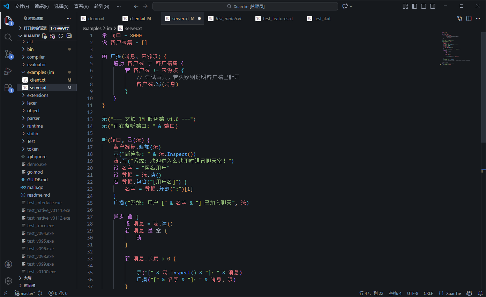

# 玄铁 (XuanTie)

[](https://gitee.com/mark-jy/xuantie)
[](https://golang.org)
[](LICENSE)
[](https://www.yuque.com/markjy/upsxwh/mr3r02mv71uloe7o)
[](https://www.yuque.com/markjy/upsxwh/pz1wdzpfhxhvceap)

**玄铁，一门融合 Go 高性能并发与 Python 简洁表达力的原生中文编程语言。**

玄铁旨在为中文开发者提供一种高熵信息含量的编程范式。它不仅是简单的语法汉化，更是针对 AI 逻辑理解与原生异步并发深度优化的现代语言。通过中文语法的自然语义，玄铁让逻辑因果更加直观，让代码即是文档。

<p align="center">
  
  <br>
  <strong>重剑无锋，大巧不工</strong>
</p>

---

## 极速上手

### Hello World
只需一行代码，开启玄铁之旅：
```xuantie
示("你好，玄铁！")
```

### 异步并发示例
玄铁原生支持异步任务与并行执行，语法极其精简：
```xuantie
// 异步执行耗时任务
设 任务 = 异步 { 
    时间.休眠(1000)
    返 "数据加载完成"
}

// 并行执行多个逻辑块
并行 {
    { 示("任务 A 运行中") },
    { 示("任务 B 运行中") }
}

示(等待(任务))
```

---

## 核心特性

- **原生中文语法**：采用全中文关键字，降低逻辑构建的认知负荷，让代码逻辑更贴近人类思维。
- **高性能并发模型**：基于 Go 协程（Goroutine）封装，提供 `异步` (Async)、`并行` (Parallel) 与 `等待` (Await) 等关键字，轻松处理高并发场景。
- **函数式错误处理**：引入 `结果` (Result) 类型，支持 `.接着()` 与 `.否则()` 链式调用，告别繁琐的错误检查。
- **完善的模块系统**：通过 `引` 关键字实现作用域隔离的模块加载，支持现代化的工程开发。
- **精准的错误诊断**：提供行列级的错误定位与代码上下文提示，让调试不再困难。

---

## 可视化演示

### 1. 语法高亮与 IDE 支持
玄铁提供专用的 VS Code 插件，支持精准的语法着色、代码片段提示以及自定义的文件图标标识。

 

### 2. 运行时错误定位
当程序出错时，玄铁会直接指出问题所在，并用指针标出：
```text
解析错误:
    [行:25, 列:1] 无法解析的 Token 类型: 示 (示)
    示("这行不应该被解析成功")
    ^
```

---

## 快速安装

1. 确保已安装 [Go](https://golang.org/dl/) (建议 1.18+)。
2. 克隆仓库：
   ```bash
   git clone https://gitee.com/mark-jy/xuantie.git
   cd xuantie
   ```
3. 运行示例：
   ```bash
   go run main.go demo.xt
   ```

---

## 发展蓝图

- [x] 原生异步并发支持 (v0.3.0)
- [x] 完善的模块引用系统 (v0.3.2)
- [x] 数学与时间标准库 (v0.3.2)
- [x] JSON 与序列化原生支持 (v0.7.0)
- [x] 类与面向对象语法支持 (v0.7.0)
- [ ] 网络编程库增强

---

## 贡献与交流

欢迎提交 Issue 或 Pull Request 来共同完善玄铁。让我们一起构建更适合中文语境的现代编程语言！

**项目主页**: [https://gitee.com/mark-jy/xuantie](https://gitee.com/mark-jy/xuantie)
